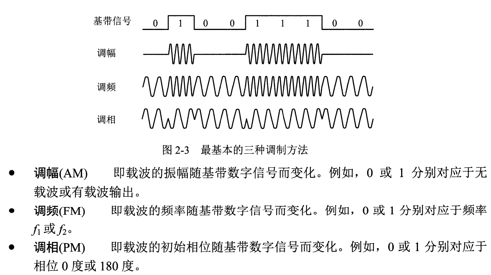

# 计算机网络

这是计算机网络的大纲（大概）。

[TOC]

# 第一章：概述

本章重要的内容有：

- 互联网边缘部分和核心部分的作用；分组交换的概念。

- 网络性能的指标。

- 计算机网络分层次的体系结构；协议和服务的概念

  

## 1.1 计算机网络在信息时代中的作用

## 1.2 互联网概述

### 1.2.1 网络的网络

​	<u>计算机网络</u>由若干<u>节点</u>和连接这些节点的<u>链路</u>组成。

### 1.2.2 互联网基础结构发展的三个阶段

### 1.2.3 互联网的标准化工作

## 1.3 互联网的组成

### 1.3.1 互联网的边缘部分

 1. 客户-服务器方式

    客户是服务请求方，服务器是服务提供方。

 2. 对等连接方式

### 1.3.2 互联网的核心部分

 1. 电路交换的主要特点

    必须经过“<u>建立连接-通话-释放连接</u>”三个步骤的交换方式称为<u>电路交换</u>。

 2. 分组交换的主要特点

    分组交换采用<u>存储转发</u>技术。每一个分组在互联网中独立地选择传输路径，并被正确地交付到分组传输的终点。

    分组交换有<u>高效、灵活、迅速、可靠</u>的优点，但是在路由器存储转发的过程中需要排队，因此会造成一定的<u>时延</u>。

    若要传输大量的数据，且传送时间远大于连接建立时间，则适合使用电路交换；否则应当使用报文交换或者分组交换。

## 1.4 计算机网络在我国的发展

## 1.5 计算机网络的类别

### 1.5.1 计算机网络的定义

​	计算机网络主要是由一些通用的、可编程的硬件互连而成的，而这些硬件并非专门用来实现某一特定目的。这些可编程的硬件能够用来传送多种不同类型的数据，并能支持广泛的和日益增长的应用。（一定有CPU）

### 1.5.2 几种不同类别的计算机网络

 1. 按照网络的作用范围进行分类

    广域网WAN、城域网MAN、局域网LAN、个人局域网PAN

 2. 按照网络的使用者进行分类

    公用网、专用网

 3. 用来把用户接入互联网的网络

    接入网AN

## 1.6 计算机网络的性能

### 1.6.1 计算机网络的性能指标

 1. 速率（$10^x$表示)

    bit/kbit/Mbit/Gbit/Tbit/Pbit/Ebit/Zbit/Ybit

 2. 带宽

    在计算机网络中，网络带宽表示单位时间内某信道所能通过的<u>最高数据率</u>，单位是bit/s。

 3. 吞吐量

    吞吐量表示在单位时间内通过某个网络的<u>实际数据量</u>。

 4. 时延

    总时延的计算公式
    $$
    总时延 = 发送时延 + 传播时延 + 处理时延 + 排队时延
    $$
    发送时延的计算公式：
    $$
    发送时延 = \frac{数据帧长度(bit/s)}{发送速率(bit/s)}
    $$
    传播时延的计算公式：
    $$
    传播时延 = \frac{信道长度(m)}{电磁波在信道上的传输速率(m/s)}
    $$
    通常有铜线 = $2.3*10^5(km/s)$，光纤 = $2.0*10^5(km/s)$。

    在某些情况下，低速率、小时延的网络可能优于一个高速率、大时延的网络。

 5. 时延带宽积
    $$
    时延带宽积 = 传播时延 * 带宽
    $$

 6. 往返时间RTT

    在计算机网络中，<u>往返时间</u>也是一个重要的性能指标。

    这是因为在许多情况下，互联网上的信息不仅仅是单方面的，而是双向交互的。

 7. 利用率

    网络当前时延计算公式如下：
    $$
    网络当前时延 = \frac{网络空闲时的时延}{1-当前网络利用率}
    $$
    写作如下的公式：
    $$
    D = \frac{D_{0}}{1-U}
    $$

	可以看到，随着利用率的增大，时延急剧增大。

### 1.6.2 计算机网络的非性能特征

​	1. 费用

​	2. 质量

​	3. 标准化

​	4. 可靠性

​	5. 可扩展性和可升级性

​	6.易于管理和维护

## 1.7 计算机网络体系结构

在计算机网络的基本概念中，<u>分层次的体系结构</u>是最基本的。

### 1.7.1 计算机网络体系结构的形成

### 1.7.2 协议与划分层次

​	<u>为了进行网络中的数据交换而建立的规则、标准或者约定称为网络协议，简称为</u><u>协议</u>。

​	协议应当由以下三要素组成：<u>语法、语义与同步</u>。

### 1.7.3 具有五层协议的体系结构

​	应用层、运输层、网络层、数据链路层、物理层。

### 1.7.4 实体、协议、服务与服务访问点

​	实体：任何可能发送或接受信息的硬件或软件进程。

​	协议：控制两个或多个对等实体进行通信的规则的集合。

​	<u>在协议的控制下，两个对等实体间的通信使得本层能向上一层提供服务</u>。要实现本层协议，还需要使用下面一层所提供的<u>服务</u>。

​	协议的实现确保了能够向上一层提供服务，使用本层服务的实体只能看到服务而看不到下面的协议，也即下面的协议对上面的实体是透明的。

# 第二章：物理层

本章的重要内容：

- 物理层的任务。

- 几种常用的信道复用技术。

- 几种常用的宽带接入技术；FTTx。

  

## 2.1 物理层的基本概念

物理层考虑的是怎样才能在连接各种计算机的传输媒体上传输数据比特流，而不是具体的传输媒体。

## 2.2 数据通信的基础知识

### 2.2.1 数据通信系统的模型

​	一个数据通信系统可以分为三大部分：<u>源系统、传输系统、目的系统</u>。

​	源系统一般包含：<u>源点、发送器</u>；目的系统一般包含：<u>接收器、终点</u>。

​	<u>通信</u>的目的是传送消息；<u>数据</u>是运送消息的实体；<u>信号</u>是数据的电气/电磁表现，可以分为<u>数字信号</u>与<u>模拟信号</u>。

### 2.2.2 有关信道的几个基本概念

​	信道不等同于电路，信道一般用来表示向某一个方向传输信息的媒体。从通信的双方信息交互的方式来看，有三种方式：

 1. 单向通信

    又称为<u>单工通信</u>，比如无线电广播。

 2. 双向交替通信

    又称为<u>半双工通信</u>。一方发送另一方接受，一段时间后再反过来。

 3. 双向同时通信

    又称为<u>全双工通信</u>，双方可以同时发送和接收信息。

​	

​	来自信源的信号常称为<u>基带信号</u>，比如计算机输出的各种文字、图像的数据信号就是基带信号。它往往包含了较多的低频分量，甚至有直流分量。而许多信道不能传输这种低频分量或直流分量，因此需要<u>调制</u>。

​	调制可以分为两类：

- 基带调制（编码）

  仅仅对基带信号的波形进行变换，使它能够与信道特性相适应。变换后的信号仍然是基带信号。

  因为它只是把数字信号转换为另一种数字信号，因此也叫做编码。

- 带通调制

  利用<u>载波</u>进行调制，把基带信号的频率范围移动到更高的频段，并转换为模拟信号，便于在模拟信道中传输。

​	常用编码方式：不归零制、归零制、曼彻斯特编码、差分曼彻斯特编码。

​	曼彻斯特编码产生的信号频率比不归零制要高。

​	基本的带通调制方法：调幅、调频、调相。（模拟信号：$ Asin(ωt+φ)$）

​	采用<u>正交振幅调制QAM</u>可以达到更高的信息传输速率。

​	

### 2.2.3 信道的极限容量

​	从概念上讲，限制码元在信道上的传输速率的因素有：

1. 信道能够通过的频率范围

   <u>奈氏准则</u>：在<u>带宽为W（Hz）</u>的低通通道中，若不考虑噪声影响，则<u>码元传输的最高速率是2W（码元/s）</u>。传输速率超过此上限就会出现严重的码间串扰问题，使得接收端对于码元的判别变得不可能。

   奈氏准则告诉我们：可以提高码元携带的比特量。

2. 信噪比

   信噪比是信号的平均功率和噪声的平均功率之比，记为S/N。但是常用分贝（db）作为度量单位，即：
   $$
   信噪比(dB)=10log_{10}(\frac{S}{N})(dB)
   $$
   例如当S/N=10时，信噪比为10dB。

   

   <u>香农公式</u>：信道的极限信息传输速率：
   $$
   C=Wlog_{2}(1+\frac{S}{N})(bit/s)
   $$
   其中W为信道带宽(Hz)，S为信道内传信号的平均功率，N为信道内的高斯噪声功率。

   香农公式表明，<u>信噪比越大，信息的极限传输速率就越高</u>。也就是说，只要信息传输速率低于信道的极限信息传输速率，就有办法实现无差错的传输。

   香农公式告诉我们：无论采用什么编码都不能突破速率极限。

   

   而当带宽确定、信噪比无法提高的时候，就要使得<u>每一个码元携带更多比特的信息量</u>来提高信息传输速率。

   比如对于101001010，直接传送的码元信息量为1bit，但是将每3bit编组，并用利用调制，比如相位调制，则可以用三个相位来表示，则此时同样时间传输的信息量是原来的三倍。

## 2.3 物理层下面的传输媒体

传输媒体（传输介质、传输媒介）可以分为两类：导引型传输媒体、非导引型传输媒体。

### 2.3.1 导引型传输媒体

 1. 双绞线

    双绞线是最老的、最常用的传输媒体。

    无屏蔽双绞线<屏蔽双绞线

 2. 同轴电缆

 3. 光缆

    光纤通信是利用光导纤维传递光脉冲来通信的。光线在纤芯中传输的方式是不断地全反射。

### 2.3.2 非导引型传输媒体

​	无线电微波通信：沿直线传播。当基站发出的信号被阻挡，于是产生多条路径到达手机的时候，多条路径的信号叠加会差生较大的失真，称为<u>多径效应</u>，需要解决。

​	当利用无线信道传输数字信号的时候，需要使误码率不大于容许的范围。

- 对于给定的调制方式和数据率，信噪比越大，误码率越低。
- 对于同样的信噪比，具有更高数据率的调制技术的误码率也更高。
- 如果地理位置在不断改变，就会引起信噪比和误码率的改变。

​	卫星通信是一种利用人造同步卫星作为中继器的微波接力通信，最大的特点是通信距离远、通信费用和通信距离无关，但是也有较大的时延。

## 2.4 信道复用技术

# 第三章：数据链路层

# 第四章：网络层

# 第五章：运输层

# 第六章：应用层

# 第七章：网络安全

# 第八章：互联网上的音视频服务

# 第九章：无线网络和移动网络

