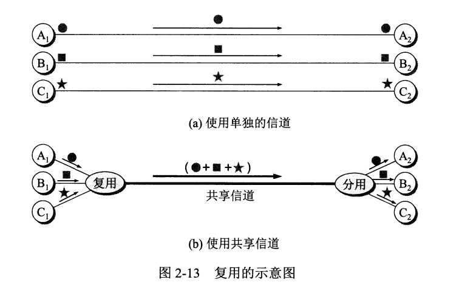
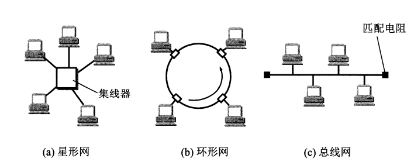
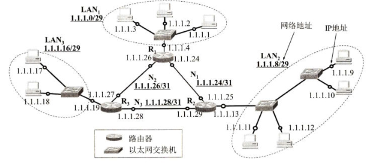
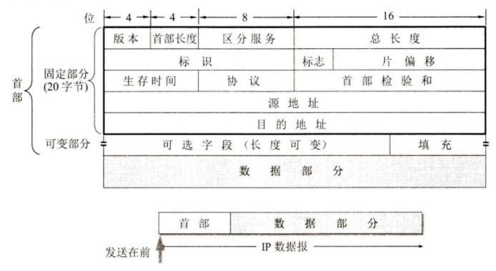
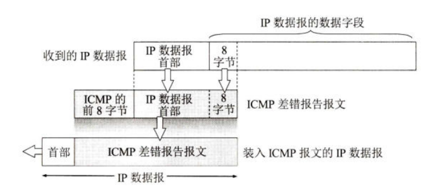
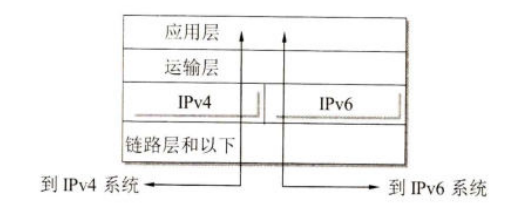

# 计算机网络

这是计算机网络的大纲（大概）

[TOC]

------

# 第一章：概述

本章重要的内容有：

- 互联网边缘部分和核心部分的作用；分组交换的概念。

- 网络性能的指标。

- 计算机网络分层次的体系结构；协议和服务的概念

  

## 1.1 计算机网络在信息时代中的作用

## 1.2 互联网概述

### 1.2.1 网络的网络

​	<u>计算机网络</u>由若干<u>节点</u>和连接这些节点的<u>链路</u>组成。

### 1.2.2 互联网基础结构发展的三个阶段

### 1.2.3 互联网的标准化工作

## 1.3 互联网的组成

### 1.3.1 互联网的边缘部分

 1. 客户-服务器方式

    客户是服务请求方，服务器是服务提供方。

 2. 对等连接方式

### 1.3.2 互联网的核心部分

 1. 电路交换的主要特点

    必须经过“<u>建立连接-通话-释放连接</u>”三个步骤的交换方式称为<u>电路交换</u>。

 2. 分组交换的主要特点

    分组交换采用<u>存储转发</u>技术。每一个分组在互联网中独立地选择传输路径，并被正确地交付到分组传输的终点。

    分组交换有<u>高效、灵活、迅速、可靠</u>的优点，但是在路由器存储转发的过程中需要排队，因此会造成一定的<u>时延</u>。

    若要传输大量的数据，且传送时间远大于连接建立时间，则适合使用电路交换；否则应当使用报文交换或者分组交换。

## 1.4 计算机网络在我国的发展

## 1.5 计算机网络的类别

### 1.5.1 计算机网络的定义

​	计算机网络主要是由一些通用的、可编程的硬件互连而成的，而这些硬件并非专门用来实现某一特定目的。这些可编程的硬件能够用来传送多种不同类型的数据，并能支持广泛的和日益增长的应用。（一定有CPU）

### 1.5.2 几种不同类别的计算机网络

 1. 按照网络的作用范围进行分类

    广域网WAN、城域网MAN、局域网LAN、个人局域网PAN

 2. 按照网络的使用者进行分类

    公用网、专用网

 3. 用来把用户接入互联网的网络

    接入网AN

## 1.6 计算机网络的性能

### 1.6.1 计算机网络的性能指标

 1. 速率（$10^x$表示)

    bit/kbit/Mbit/Gbit/Tbit/Pbit/Ebit/Zbit/Ybit

 2. 带宽

    在计算机网络中，网络带宽表示单位时间内某信道所能通过的<u>最高数据率</u>，单位是bit/s。

 3. 吞吐量

    吞吐量表示在单位时间内通过某个网络的<u>实际数据量</u>。

 4. 时延

    总时延的计算公式
    $$
    总时延 = 发送时延 + 传播时延 + 处理时延 + 排队时延
    $$
    发送时延的计算公式：
    $$
    发送时延 = \frac{数据帧长度(bit/s)}{发送速率(bit/s)}
    $$
    传播时延的计算公式：
    $$
    传播时延 = \frac{信道长度(m)}{电磁波在信道上的传输速率(m/s)}
    $$
    通常有铜线 = $2.3*10^5(km/s)$，光纤 = $2.0*10^5(km/s)$。

    在某些情况下，低速率、小时延的网络可能优于一个高速率、大时延的网络。

 5. 时延带宽积
    $$
    时延带宽积 = 传播时延 * 带宽
    $$

 6. 往返时间RTT

    在计算机网络中，<u>往返时间</u>也是一个重要的性能指标。

    这是因为在许多情况下，互联网上的信息不仅仅是单方面的，而是双向交互的。

 7. 利用率

    网络当前时延计算公式如下：
    $$
    网络当前时延 = \frac{网络空闲时的时延}{1-当前网络利用率}
    $$
    写作如下的公式：
    $$
    D = \frac{D_{0}}{1-U}
    $$

	可以看到，随着利用率的增大，时延急剧增大。

### 1.6.2 计算机网络的非性能特征

​	1. 费用

​	2. 质量

​	3. 标准化

​	4. 可靠性

​	5. 可扩展性和可升级性

​	6.易于管理和维护

## 1.7 计算机网络体系结构

在计算机网络的基本概念中，<u>分层次的体系结构</u>是最基本的。

### 1.7.1 计算机网络体系结构的形成

### 1.7.2 协议与划分层次

​	<u>为了进行网络中的数据交换而建立的规则、标准或者约定称为网络协议，简称为</u><u>协议</u>。

​	协议应当由以下三要素组成：<u>语法、语义与同步</u>。

### 1.7.3 具有五层协议的体系结构

​	应用层、运输层、网络层、数据链路层、物理层。

### 1.7.4 实体、协议、服务与服务访问点

​	实体：任何可能发送或接受信息的硬件或软件进程。

​	协议：控制两个或多个对等实体进行通信的规则的集合。

​	<u>在协议的控制下，两个对等实体间的通信使得本层能向上一层提供服务</u>。要实现本层协议，还需要使用下面一层所提供的<u>服务</u>。

​	协议的实现确保了能够向上一层提供服务，使用本层服务的实体只能看到服务而看不到下面的协议，也即下面的协议对上面的实体是透明的。

------

# 第二章：物理层

本章的重要内容：

- 物理层的任务。

- 几种常用的信道复用技术。

- 几种常用的宽带接入技术；FTTx。

  

## 2.1 物理层的基本概念

物理层考虑的是怎样才能在连接各种计算机的传输媒体上传输数据比特流，而不是具体的传输媒体。

## 2.2 数据通信的基础知识

### 2.2.1 数据通信系统的模型

​	一个数据通信系统可以分为三大部分：<u>源系统、传输系统、目的系统</u>。

​	源系统一般包含：<u>源点、发送器</u>；目的系统一般包含：<u>接收器、终点</u>。

​	<u>通信</u>的目的是传送消息；<u>数据</u>是运送消息的实体；<u>信号</u>是数据的电气/电磁表现，可以分为<u>数字信号</u>与<u>模拟信号</u>。

### 2.2.2 有关信道的几个基本概念

​	信道不等同于电路，信道一般用来表示向某一个方向传输信息的媒体。从通信的双方信息交互的方式来看，有三种方式：

 1. 单向通信

    又称为<u>单工通信</u>，比如无线电广播。

 2. 双向交替通信

    又称为<u>半双工通信</u>。一方发送另一方接受，一段时间后再反过来。

 3. 双向同时通信

    又称为<u>全双工通信</u>，双方可以同时发送和接收信息。

​	

​	来自信源的信号常称为<u>基带信号</u>，比如计算机输出的各种文字、图像的数据信号就是基带信号。它往往包含了较多的低频分量，甚至有直流分量。而许多信道不能传输这种低频分量或直流分量，因此需要<u>调制</u>。

​	调制可以分为两类：

- 基带调制（编码）

  仅仅对基带信号的波形进行变换，使它能够与信道特性相适应。变换后的信号仍然是基带信号。

  因为它只是把数字信号转换为另一种数字信号，因此也叫做编码。

- 带通调制

  利用<u>载波</u>进行调制，把基带信号的频率范围移动到更高的频段，并转换为模拟信号，便于在模拟信道中传输。

​	常用编码方式：不归零制、归零制、曼彻斯特编码、差分曼彻斯特编码。

​	曼彻斯特编码产生的信号频率比不归零制要高。

​	基本的带通调制方法：调幅、调频、调相。（模拟信号：$ Asin(ωt+φ)$）

​	采用<u>正交振幅调制QAM</u>可以达到更高的信息传输速率。

​	

### 2.2.3 信道的极限容量

​	从概念上讲，限制码元在信道上的传输速率的因素有：

1. 信道能够通过的频率范围

   <u>奈氏准则</u>：在<u>带宽为W（Hz）</u>的低通通道中，若不考虑噪声影响，则<u>码元传输的最高速率是2W（码元/s）</u>。传输速率超过此上限就会出现严重的码间串扰问题，使得接收端对于码元的判别变得不可能。

   奈氏准则告诉我们：可以提高码元携带的比特量。

2. 信噪比

   信噪比是信号的平均功率和噪声的平均功率之比，记为S/N。但是常用分贝（db）作为度量单位，即：
   $$
   信噪比(dB)=10log_{10}(\frac{S}{N})(dB)
   $$
   例如当S/N=10时，信噪比为10dB。

   

   <u>香农公式</u>：信道的极限信息传输速率：
   $$
   C=Wlog_{2}(1+\frac{S}{N})(bit/s)
   $$
   其中W为信道带宽(Hz)，S为信道内传信号的平均功率，N为信道内的高斯噪声功率。

   香农公式表明，<u>信噪比越大，信息的极限传输速率就越高</u>。也就是说，只要信息传输速率低于信道的极限信息传输速率，就有办法实现无差错的传输。

   香农公式告诉我们：无论采用什么编码都不能突破速率极限。

   

   而当带宽确定、信噪比无法提高的时候，就要使得<u>每一个码元携带更多比特的信息量</u>来提高信息传输速率。

   比如对于101001010，直接传送的码元信息量为1bit，但是将每3bit编组，并用利用调制，比如相位调制，则可以用三个相位来表示，则此时同样时间传输的信息量是原来的三倍。

## 2.3 物理层下面的传输媒体

传输媒体（传输介质、传输媒介）可以分为两类：导引型传输媒体、非导引型传输媒体。

### 2.3.1 导引型传输媒体

 1. 双绞线

    双绞线是最老的、最常用的传输媒体。

    无屏蔽双绞线 < 屏蔽双绞线

 2. 同轴电缆

 3. 光缆

    光纤通信是利用光导纤维传递光脉冲来通信的。光线在纤芯中传输的方式是不断地全反射。

### 2.3.2 非导引型传输媒体

​	无线电微波通信：沿直线传播。当基站发出的信号被阻挡，于是产生多条路径到达手机的时候，多条路径的信号叠加会差生较大的失真，称为<u>多径效应</u>，需要解决。

​	当利用无线信道传输数字信号的时候，需要使误码率不大于容许的范围。

- 对于给定的调制方式和数据率，信噪比越大，误码率越低。
- 对于同样的信噪比，具有更高数据率的调制技术的误码率也更高。
- 如果地理位置在不断改变，就会引起信噪比和误码率的改变。

​	卫星通信是一种利用人造同步卫星作为中继器的微波接力通信，最大的特点是通信距离远、通信费用和通信距离无关，但是也有较大的时延。

## 2.4 信道复用技术

复用是通信技术中的基本概念。

复用是利用复用器和分用器实现一个信道传输多路信号的操作。

### 2.4.1 频分复用、时分复用、统计时分复用

​	频分复用FDM：频分复用是利用调制的方法，将各路信号移动到合适的频率位置。各路信号在同样的时间占用不同的频率带宽资源。

​	时分复用TDM：将时间划分为一段段等长的时分复用帧，每个型号所占用的时隙周期性的出现。所有用户在不同时间占用同样的频段宽度。

​	让多个用户轮流使用N个频段称为频分多址接入FDMA；让多个用户轮流使用时隙称为时分多址接入TDMA。

​	统计时分复用STDM是一种改进的时分复用。统计时分复用使用STDM帧来传送数据，但是帧中的时隙数小于用户数，而当用户有了数据就发送到集中器的输入缓存中，然后集中器把缓存缓存中的数据输入到帧中，帧满了就发送。

### 2.4.2 波分复用

​	波分复用WDM，就是<u>光的频分复用</u>，使用一根光纤来传输多个频率接近的光载波信号。

### 2.4.3 码分复用

​	码分复用CDM是另一种共享信道的方法。当码分复用信道为多个不同地址的用户所共享的时候就称为码分多址CDMA。

​	码分复用的每一个人可以在同样的时间使用同样的频带进行通信，但由于码型不同，因此用户之间不会产生干扰。

​	在CDMA中，每一个比特时间再划分为m个短的间隔，称为<u>码片</u>，使用CDMA的每一个站都被指派唯一的 $m$ bit码片序列。对于发送，有以下规则：

- 如果要发送比特1，则发送 $m$ bit码片序列。
- 如果要发送比特0，则发送该码片序列的反码。

​	例如，指派给S站的8bit码片序列为00011011，则如果要发送比特1则发送序列00011011，而发送比特0时则发送11100100。为了方便，在这里我们将其中的0记为-1，1记为+1，也即S站的码片序列为（-1 -1 -1 +1 +1 -1 +1 +1）。

​	在这里可以看出，如果要发送的信息数据率为 $b$ bit/s, 而S站如果有 $m$ bit码元序列，则实际上发送的数据率要到 $mb$ bit/s。因此需要用到<u>扩频</u>技术。在这里使用的是<u>直接序列扩频DSSS</u>，还有一种方法是<u>调频扩频FHSS</u>。

​	

​	CDMA系统有一个重要特点：每个站的码片序列不仅必须各不相同，还必须<u>正交</u>。在这里假设两个站的码片序列为$\vec{S}$, $\vec{T}$，则应当有：
$$
\vec{\mathbf{S}} \cdot \vec{\mathbf{T}} =0
$$
​	不仅如此，我们还可以看出，任何一个码片序列向量和自己的规格化内积都是0：
$$
\mathbf{\vec{S}} \cdot \mathbf{\vec{S}} = 1
$$
​	同理，我们也可以得到如果一个码片向量和反码的向量的规格化内积为-1。	

​	那么现在，假设有一个X站要接收S站发送的信号，则X站必须知道S站的码片序列，然后利用X站得到的码片向量$\vec{S}$进行解码。假设还有一个T站也在发送序列$\vec{T_{x}}$，则根据叠加原理，可以这么计算：
$$
\begin{array}{l}  
接收到的信号 \\
= \vec{S} \cdot (\vec{S_{x}} + \vec{T_{x}}) \\
= \vec{S} \cdot \vec{S_{x}} + \vec{S} \cdot \vec{T_{x}} \\
= \vec{S} \cdot \vec{S_{x}} (发送的数据比特，因为运算的结果一定是+1/-1) + 0(一定为0，因为正交) \\
= 发送的数据
\end{array}
$$

## 2.5 数字传输系统

早期的数字传输系统速率标准不统一、也不是同步传输。

## 2.6 宽带接入技术

从宽带的接入媒体来看，可以划分为两大类：有线宽带接入、无线宽带接入。

### 2.6.1 ADSL技术

​	非对称用户数字线ADSL技术是<u>用数字技术对现有模拟电话的用户线进行改造</u>。它把0~4KHz低端频谱留给传统电话使用，而把较高频谱给用户上网使用。因为下行带宽远大于上行带宽，因此是“非对称”。

​	ADSL两端都需要安装ADSL调制解调器。我国采用的是离散多音调DMT调制技术。这种做法相当于在一对用户线上使用许多小的调制解调器并行的传输数据。

​	基于ADSL的接入网由<u>数字用户线接入复用器DSLAM、用户线、用户家中设施</u>三部分组成。ADSL可以利用现有的电话网中的用户线，而不需要重新布线。

### 2.6.2 光纤同轴混合网（HFC网）

​	光纤同轴混合网是在目前覆盖面很广的有线电视网的基础上开发的一种居民宽带接入网。目前的HFC网具有双向传输功能，而且扩展了传输频带。

​	要使现有的模拟电视能接收数字信号，需要把<u>机顶盒</u>连接在同轴电缆和电视机之间。为了使用户能够接入互联网，还需要增加<u>电缆调制解调器</u>。

### 2.6.3 FTTx技术

​	光纤到户FTTH是最好的选择，这可以使用户获得最高的上网速率。FTTx中的x表示不同的光纤接入地点。

​	为了有效地利用光纤资源，在光纤干线和广大用户之间，还要铺设一段中间的转换装置<u>光配线网</u>，使得数十个家庭用户能共享一个光纤干线。光配线网使用波分复用，上行和下行使用不同的带宽。

------

# 第三章：数据链路层

数据链路层使用的信道主要分为：点对点通信、广播信道。

在本章中，主要研究的是在同一个局域网中，分组怎样从一个主机传输到另一个主机，但不经过路由器的转发。从整个互联网来看，局域网仍然属于数据链路层的范围。

本章将首先介绍点对点通信，以及在这种信道上最常用的协议PPP。然后再介绍共享信道的局域网，以及有关的协议。

本章的重要内容有：

- 数据链路层的点对点信道和广播信道的特点，以及PPP协议、CSMA/CD协议的特点。
- 数据链路层的三个问题：封装成帧、透明传输以及差错检测。
- 以太网MAC层的硬件地址。
- 适配器、转发器、集线器、网桥、以太网交换机的作用以及使用场合。

## 3.1 数据链路层的几个问题

### 3.1.1 数据链路和帧

​	数据链路指的是传输数据的线路、协议、实现协议的硬件、软件等的集合体。现在最常用的方法就是网络适配器来实现这些协议，一般的网络适配器都会包括数据链路层和物理层两层的功能。

​	帧是点对点通信的数据链路层的协议数据单元。数据链路层把网络层放下来的数据封装成帧，并把接受大的帧中的数据取出交给网络层。

### 3.1.2 三个基本问题

​	数据链路层的协议有很多，但是三个基本问题是共同的：封装成帧，透明传输和差错检测。

1. 封装成帧

   ​	封装成帧是指在一段数据的前后分别添加首部和尾部，这样就构成了一个帧。首部和尾部的一个重要作用是帧定界，除此之外也包含了必要的控制信息。

   ​	每一种链路层协议都规定了能传送帧的数据部分长度上限，也即最大传送单元 MTU 。

   

   ​	对于一个帧来说，用 SOH 标识头部、EOT 标识尾部，其对应的ASCII码为01、04。

   

2. 透明传输

   ​	透明是指，某一个实际存在的事物看起来却好像不存在一样。

   ​	在传输中，如果出现了某一个字节正好与 SOH 或者 EOT 对应的二进制代码一样的情况，那么数据链路层就会错误的找到帧的边界。为了解决这个问题，就必须使得数据中可能出现的 SOH 或者 EOT 不被解释为控制字符。

   ​	一般的方法是，在数据中的 SOH 或者 EOT 前面插入一个转义字符  ESC （1B），而接收时则会删除这个转义字符。这种方法也被称为**字节填充**或是**字符填充**。

   ​	如果转义字符也出现在数据中，那么就应当在转义字符前也添加一个转义字符。

   

   

3. 差错检测（重要）

   ​	在传输过程中，比特可能会产生差错：1变0，0变1都是有可能的。这种差错叫做**比特差错**。为了解决 差错问题，目前在数据链路层最广泛使用的检错技术叫做：<u>循环冗余检验 CRC</u>。

   ​	CRC 在发送端把数据划分成组，假设划分完成之后的数据 M 有 k 位，则在 M 后面添加 n 位**冗余码**，然后构成一个 k+n 位的帧发送出去，以此完成差错检验。

   ​	这 n 位冗余码可以这样得出：在 M 后面添加 n 个0，然后用得到的 k+n 位数除以事先规定好的 n+1 位除数 P，得到商 Q 和 余数 R（n 位，比 P 少一位）。这个余数 R 就是冗余码，我们称它为<u>帧检验序列FCS</u>。

   ​	而在接收端，把接收到的每一个帧都除以相同的除数 P ，然后检查得到的余数 R ，如果传输无差错，那么 R 肯定为 0。

   

   ​	在这里需要注意的是，CRC 和 FCS 并无关系。CRC 是一种检错方法，而 FCS 是冗余码。在检错方法中，可以使用 CRC，也可以不使用。

   

   ​	但是利用 CRC 的话，也只能做到检测比特差错，对于传输差错则并不能检验，因此这还不是可靠传输。在过去认为，必须让数据链路层向上提供可靠传输，也即在 CRC 的基础上增加帧编号、确认和重传机制，但是现在采用了其他的方法：

   ​	1、对于通信质量良好的链路，不要求数据链路层向上提供可靠传输的服务。如果出现了差错，则由上层协议改正差错。

   ​	2、对于通信质量不好的线路，数据链路层协议使用确认和重传机制，由数据链路层向上提供可靠传输的服务。

## 3.2 点对点协议 PPP

对于点对点的链路，PPP 是目前使用的最广泛的数据链路层协议。

### 3.2.1 PPP 协议的特点

1. PPP 协议应满足的要求

   1、简单

   2、封装成帧

   3、透明性

   4、多种网络层协议

   5、多种类型链路

   6、差错检测

   7、检测连接状态

   8、最大传送单元

   9、网络层地址协商

   10、数据压缩协商

   

2. PPP协议的组成

   1、一个将IP地址封装到串行链路的方法。

   2、一个用来建立、配置和测试数据链路连接的链路控制协议。

   3、一套网络控制协议。

### 3.2.2 PPP 协议的帧格式

​	首部有四个字段，尾部有两个字段。首部第一个字段和尾部第二个字段都是标志字符 F（7E)，而首部中的地址字段规定为 A ，控制字段规定为 C 。

​	首部的第四个字段是 2 字节的协议字段，若为 0x0021 时，PPP 帧信息字段为 IP 数据报；为 0xC021 时，为 PPP 链路控制协议 LCP 的数据；为 0x8021时，标识这是网络层的控制数据。

​	尾部第一个字段是使用 CRC 的帧检验序列 FCS。

​	

​	当 PPP 使用异步传输（逐个字符的传输）的时候，他把转义符定义为 0x7D，并使用字节填充。而当他在同步传输（一连串比特连续发送）的时候，使用零比特填充的方法实现透明传输：每当发现出现5个连续的1时，就填入一个1，防止出现6个1。

### 3.2.3 PPP 协议的工作状态

​	PPP 链路的起始和终止状态永远是链路静止状态，这时在用户个人电脑和 ISP 的路由器之间并不存在物理层的连接。

## 3.3 使用广播信道的数据链路层

广播信道可以进行一对多的通信，局域网使用的就是广播信道。

### 3.3.1 局域网的数据链路层

​	局域网的最主要的特点是：网络为一个单位所拥有，且地理范围和站点数目均有限。

​	局域网可以按照网络拓扑进行分类：

​	共享信道要着重考虑的一个问题是，如何使众多用户能海购合理方便地享受通信媒体资源，这在技术上有两种方法：

- 静态划分信道，如频分复用、时分复用、波分复用、码分复用等。用户只要分配到了信道就不会发生冲突，但是代价较高。
- 动态媒体接入控制，又称多点接入，可以分为随机接入和受控接入。随机接入地特点是用户可以随机的发送信息，但是必须要有解决碰撞的协议。

​	在这里，我们着重讨论属于随机接入的以太网。

1、以太网的两个标准

​	目前使用最多的局域网是 DIX Ethernet V2 ，简称以太网，而不是IEEE 802委员会制定的局域网。

2、适配器的作用

​	计算机和外界局域网是通过**适配器**。

- 适配器和局域网之间的通信是通过电缆以串行方式进行的，而适配器和计算机之间的通信是通过总线以并行方式进行的，因此适配器需要能串行并行转换。
- 因为网络上的数据率和计算机总线的并不相同，因此要有缓存芯片。
- 还要能把管理适配器的驱动程序安装在计算机的操作系统中。
- 还要能够实现以太网协议。

​	

​	适配器在接收和发送数据的时候，不适用计算机的CPU。

### 3.3.2 CSMA/CD 协议

​	最早的以太网是将许多计算机连接在一根总线上。当一台计算机发送数据时，总线上的所有计算机都能检测到这个数据，这种就是广播通信。

​	为了简便的通信，以太网采取了两种措施：

1. 采用**无连接**的工作方式，不必先建立连接就可以直接发送数据。因此，以太网提供的是**不可靠的交付**。

   我们知道，总线上在同一时间只能允许一台计算机发送数据，否则就会产生干扰。因此以太网使用 **CSMA/CD（载波监听多点接入/碰撞检测）协议**来减少冲突。

2. 以太网发送的数据都使用**曼彻斯特编码**的信号。

​	下面介绍 CSMA/CD 协议的要点：

​	“多点接入”就是说明这是总线型网络，协议的实质是“载波监听”和“碰撞检测”。

​	“载波监听”是指检测总线上是否有其他计算机在发送。不管是在发送前，还是发送中，每个站都必须不停的检测信道。如果检测到已经有其他站在发送，则自己暂时不发送。

​	“碰撞检测”也就是“边发送边监听”，即适配器边发送数据边检测信道上的信号电压，当电压超过一定的阈值时，就认为有至少两个站在发送数据，表明产生碰撞。一旦发现总线出现碰撞，就要立即停止发送。

​	但是为什么在发送前监听到信道已经“空闲”，还是可能会出现碰撞？这是因为电磁波的传输速率是有限的，比如在 1km 的电缆中传播时延约为 5μs 。因此，还是有可能产生碰撞的。

​	在局域网的分析中，把单程的端到端传输时延记为 t ，则最迟需要 2t 的时间才能知道有无发生碰撞。

​	显然，在使用 CSMA/CD 协议的时候，一个站不可能同时进行发送和接收，因此使用 CSMA/CD 的以太网只能进行**半双工通信（双向交替通信）**。由此可见，每一个站在在自己发送数据之后的一小段时间内，存在着遭遇碰撞的可能性，而这一小段时间是不确定的。

​	在以太网中，我们称 **2t** 为**争用期**。这是一个重要的参数，又称为**碰撞窗口**。具体来说，争用期是 **51.2μs** 。对于一个 10 Mbits/s 的网络来说，争用期可以发送 512 bit，或者说是 64 字节，因此称其争用期为 512bit。

​	除此之外，以太网还规定帧的最小长度是 64 字节，**小于 64 字节的帧都是由于冲突而异常终止的无效帧**。

​	当发送数据的站一旦发现产生碰撞的时候，要继续发送一个 32 比特或者 48  比特的**人为干扰信号**，让所有用户知道发生了碰撞。这被称为**强化碰撞**。

​	以太网还规定帧间最小间隔为 9.6μs 相当于 96 比特时间。这样是为了让站做好接收下一帧的准备。

​	根据以上所讨论的，可以把 CSMA/CD 协议的要点归纳如下:

​	(1)准备发送:适配器从网络层获得一个分组，加上以太网的首部和尾部(见后面的3.4.3 节)，组成以太网，放入适配器的缓存中。但在发送之前，必须先检测信道。

​	(2)检测信道:若检测到信道忙，则应不停地检测，一直等待信道转为空闲。若检测到信道空闲，并在 96 比特时间内信道保持空闲(保证了间最小间隔)，就发送这个帧。

​	(3)在发送过程中仍不停地检测信道，即网络适配器要边发送边监听。这里只有两种可能性:

​		1、发送成功:在争用期内一直未检测到碰撞。这个帧肯定能够发送成功。发送完毕后，其他什么也不做。然后回到(1)。

​		2、发送失败:在争用期内检测到碰撞。这时立即停止发送数据，并按规定发送人为干扰信号。适配器接着就执行指数退避算法，等待广倍 512 比特时间后，返回到步(2)，继续检测信道。但若重传达 16 次仍不能成功，则停止重传而向上报错。

​	以太网每发送完一帧，一定要把已发送的帧暂时保留一下。如果在争用期内检测出发生了碰撞，那么还要在推迟一段时间后再把这个暂时保留的帧重传一次。

### 3.3.3 使用集线器的星型拓扑

​	以太网发展到后来采用来星型拓扑的结构，在星形的中心增加了集线器。

​	集线器的特点有：

1. 从表面上看是星形网，但是实际上整个系统在逻辑上还是总线网，使用的还是 CSMA/CD 协议。在同一时刻至多允许一个站发送数据。

2. 一个集线器有多个端口，像是一个多端口的转发器。

3. **集线器工作在物理层**，每个接口也只是简单的转发比特，**不进行碰撞检测**。

   

### 3.3.4 以太网的信道利用率

​	因为碰撞的存在，以太网的信道利用率实际上无法达到100%。

​	从图中可以看出，发送一个帧需要占用信道的时间是 $T_0 + \tau $，比发送这个帧的时间要多一个单程端到端时延。从图中可以看出，如果要提高信道利用率，就必须降低 $\alpha = \frac{\tau}{T_0}$ 的值。也就是说，$\tau$ 的值药效，而 $T_0$ 的值要大，也就是说数据率一定时，以太网的连线受到长度限制，否则 $\tau$ 的数值会太大；同时以太网的帧长不能太短，否则 $T_0$ 会小。

### 3.3.5 以太网的 MAC 层

- MAC层的硬件地址

  ​	在局域网中，**硬件地址**又称为**物理地址**或者 **MAC地址** 。为了让名字与系统的所在地无关，IEEE 802制定了一种 48 位的全球地址，这就是固化在适配器 ROM 中的地址。IEEE 的注册管理机构 RA 负责分配地址字段的六个字节中的前三个字节。凡事要生产局域网适配器的厂家都必须向 IEEE 购买这三个字节组成的号。

  ​	当路由器通过适配器连接到局域网的时候，适配器的硬件地址就用来标志路由器的某个接口。我们知道适配器有**过滤功能**：如果是接收到发往本站的帧就留下，否则丢弃。在这里，发往本站的帧包括三种：单播帧、广播帧、多播帧。

  ​	除此之外，以太网适配器还可以设置成一种特殊的模式：**混杂方式**。这种方式会把以太网上的帧都记录下来。

  ​	

- MAC帧的格式

  ​	这里介绍的是使用最多的以太网 V2 的 MAC 帧格式。

  

  ​	以太网 V2 的 MAC 较为简单，由五个字段组成：

  ​	前两个字段分别为 6 字节长的目的地址和源地址字段。

  ​	第三个字段是 2 字节的类型字段，用来标志上一层使用的是什么协议，以便把收到的 MAC 的数据上交给上一层的这个协议。例如，当类型字段的值是 0x0800时，就表示上层使用的是 IP 数据报。
  ​	第四个字段是数据字段，其长度在 46 到 1500 字节之间 （46 字节是这样得出的：最小长度 64 字节，减去 18 字节的首部和尾部就得出数据字段的最小长度）。

  ​	最后一个字段是 4 字节的帧检验序列 FCS（使用 CRC 检验）。FCS 的检验范围是整个 MAC 帧，从目的地址到 FCS 的五个字段，但不包括物理层插入的。

  

  ​	从图中也能看出，在传输媒体上实际传输的要比 MAC 帧还多 8 个字节，这是因为一个站在刚开始接收的时候，尚未达成同步，会导致整个 MAC 帧无效。

  ​	IEEE 802.3标准规定凡出现下列情况之一的即为无效的MAC :
  ​	(1)的不是整数个字节;
  ​	(2)用收到的检验序列FCS查出有差错
  ​	(3)收到的的MAC客户数据字段的长度不在46 ~ 1500 字节之间。考虑到MAC 首部和尾部的长度共有 18 字节，可以得出有效的MAC 长度为 64~1518 字节之间。
  ​	

  ​	对于检查出的无效 MAC 就简单地丢弃。以太网不负责重传丢弃的帧。重传由更高层完成。

## 3.4 扩展的以太网

在许多情况下，我们希望把以太网的覆盖范围扩展。先讨论在物理层扩展以太网，然后讨论在数据链路层扩展。这种扩展的以太网仍然是一个网络。

### 3.4.1 在物理层扩展以太网

​	现在扩展主机和集线器之间的距离的一种简单方式就是使用光纤，以及一对光纤调制解调器。

​	如果使用多个集线器，就可以构成更大的以太网。

​	这样做，可以使不同以太网上的计算机能够进行交流，也扩大了以太网的覆盖范围。

### 3.4.2 在数据链路层扩展以太网

​	最初人们使用的是网桥。后面替换成使用交换式集线器（也被称为以太网交换机）。

1. 以太网交换机的特点

   ​	以太网交换机本质上是一个多端口的网桥，每个端口都直接与一个单台主机或者另一个以太网交换机相连，并且一般工作在全双工模式。相互通信的主机都**独占传输媒体，无碰撞的传输数据**。比如对于一个 10Mbit/s 的以太网，一个10个端口的交换机的总容量就为 100Mbit/s 。

   ​	交换机内部的帧交换表是通过自学习算法建立起来的。这也是交换机的最大优点。

   

2. 以太网交换机的自学习功能

   ​	对于一个交换机，交换机需要记录的信息是**源地址**和端口。

   

   ​	此外，考虑到交换机的端口的主机可能变换，因此在交换表中写入之后会记录时间。超过一定时间之后就会被删除。

   

   ​	有时，为了增加网络的可靠性，会增加一些冗余的链路。这种情况下，可能会产生无限的循环。

   

   ​	因此，IEEE 802.1D 标准制定了**生成树协议 STP**，在不改变网络拓扑结构的前提下，在逻辑上切断某些链路，使得一台主机到所有其他主机的路径是**无环路的树状结构**。

   

3. 从总线以太网到星形以太网

   

### 3.4.3 虚拟局域网

​	在以太网交换机出现后，我们可以灵活的建立虚拟局域网。这样就能把较大的局域网，分割成一些较小的局域网。

​	虚拟局域网只是局域网给用户提供的一种服务，并不是一种新型局域网。在虚拟局域网中，每台计算机都是通过**接入链路**连接到以太网交换机中的，而连接交换机端口之间的链路称为**汇聚链路**。

## 3.5 高速以太网

随着电子技术的发展，以太网的速率也不断提升。

### 3.5.1 100BASE-T 以太网

### 3.5.2 吉比特以太网

​	吉比特以太网的物理层使用两种技术：一种来自现有的以太网；另一种是 ANSI 制定的光纤通道 FC 。吉比特以太网工作在半双工模式的时候，必须进行碰撞检测。吉比特以太网保持一个网段的最大长度为 100 m，但采用**“载波延伸”**的方法，使最短帧长为 64 字节，同时将争用期增加值 512 字节。

​	吉比特还增加了**分组突发**的功能。当第一个短帧发送完之后，随后的一些短帧可以一个接一个的发送，只需要保留必要的帧最小间隔即可。

​	当吉比特以太网工作在全双工模式的时候，不适用载波延伸和分组突发。

### 3.5.3 10Gbe 以太网和更快的以太网

​	10Gbe 的帧格式与 10 Mbit/s、100 Mbit/s 和 1 Gbit/s 的帧根式完全相同，并保留了 802.3 标准规定的最小帧长和最大帧长。**10Gbe 只工作在全双工模式，因此不存在争用问题，也不使用 CSMA/CD 协议。**

# 第四章：网络层

本章讨论网络互联问题。在介绍网络层提供的两种服务和两个层面后，进入到网际协议 IP 。本章还要讨论网际控制报文协议 ICMP 、路由选择协议、IPv6 的主要特点、IP 多播的概念、虚拟局域网 VPN、网络地址转换 NAT 、多协议标签交换 MPLS 、软件定义网络 SDN。

本章的重要内容：

- 虚拟互联网络、两种服务和两个层面。
- IP 地址和 MAC 地址的关系。
- 传统分类的 IP 地址和无分类域间路由选择 CIDR。
- 路由选择协议的工作原理。

## 4.1 网络层的重要概念

### 4.1.1  网络层提供的两种服务

​	互联网的先驱者提出，电信网提供的端到端可靠传输的服务对用户电话业务是合适的，**但是对于互联网来说，网络层要设计得尽量简单，向其上层提供简单灵活的、无连接的，尽最大努力交付的数据报服务。**在这里，数据报、分组是同义词。也就是说，**网络层不提供服务质量的承诺**，传送的数据可能会出现问题。如果主机需要进行可靠通信，则由运输层负责差错处理、流量控制等。

​	OSI体系的支持者曾主张应该使用可靠的**虚电路服务**，但被**数据报服务**淘汰了。

### 4.1.2 网络层的两个层面

​	在路由器之间传送的信息有两类：

​	1、转发源主机和目的主机之间所传送的数据。

​	2、传送路由信息。这类信息的传送是为了第一类数据的传送服务的。

​	

​	用较为抽象的方式来描述，就是将网络划分为**数据层面**（或**转发层面**）和**控制层面**。

## 4.2 网际协议 IP

网际协议 IP 是 TCP/IP 体系中两个最主要的协议之一。与 IP 协议配套使用的还有这三个协议：

- 地址解析协议 ARP
- 网际控制报文协议 ICMP
- 网际组管理协议 IGMP

在讨论网际协议 IP 之前，首先要了解虚拟互联网络。

### 4.2.1 虚拟互联网络

我们知道，如果要把全世界范围内的网络都互连起来的话，会变得非常复杂，因为许多网络的标准都不一样。而且，由于用户的需求是多样的，因此**没有一种单一的网络能适应所有用户的标准**。

从一般的概念来说，将网络互连起来需要一些中间设备：

- 物理层使用的中间设备叫做**转发器**
- 数据链路层使用的中间设备叫做**网桥**或者**桥接器**，以及**交换机**
- 网络层使用的中间设备叫做**路由器**
- 在网络层以上使用的中间设备叫做**网关**

在我们常说的网络互连中，是指利用路由器进行网络互连和路由选择。

在下图中可以看到，由于参加互连的计算机都是用相同的网际协议 IP，因此可以把他们看成一个**虚拟互连网络**，这样在网络层看来就是一个统一的网络。也就是说，**互联网可以由多个异构网络互连组成。**

### 4.2.2 IP 地址

在 TCP/IP 体系中，IP 地址是最基本的概念。一个链接在互联网上的设备，如果没有 IP 地址，就无法和互联网上的其他设备通信。

1. IP 地址及其表示方法

   ​	整个互联网就是一个**单一的、抽象的网络**。IP 地址就是给连接到互联网上的每一个主机的每一个接口分配一个在全世界范围内是唯一的 32 位标识符。为了方便阅读，我们利用点分十进制计数法将 IP 地址表述为便于阅读的方式。

   

   ​	通常，IP 地址可以分为两部分：网络号、主机号。下面将讨论这个问题。

   

2. 分类的 IP 地址

   ​	在互联网发展早期采用的是分类的 IP 地址，如图所示。

   

   ​	从图中可以看出，A 类地址占了 $2^{31}$ 个，也就是一半，其他的也同理。而且，只要给出一个二进制数表示的 IP 单播地址，就可以很容易的知道是哪一类地址，也能看出主机号。

   ​	A 类网络有 7 位可以表示网络号，但是全 0 的表示**本网络**，全 1 的（01111111）表示**环回测试**，留作本机进程之间通信使用。所以 A 类地址可指派的网络号有 $2^7 - 2 =126$ 个，从1到127。

   ​	A 类网络的主机号占 3 个字节，但是全 0 和全 1 一般不指派，全 0 表示本主机连接到的网络地址（比如主机的 IP 是 5.6.7.8 ，则网络地址为 5.0.0.0），全 1 表示网络上的所有主机。故每一个 A 类网络中最大主机数为 $2^{24} - 2$个

   ​	B 类网络可以指派的网络数目为 $2^{14}$ 个，每一个网络中最大主机数为 $2^{16} -2$ 个。

   ​	C 类网络可以指派的网络数目为 $2^{21}$ 个，每一个网络中最大主机数为 $2^{8} -2$ 个。

   ​	但是这样的分类会造成浪费，于是新的方法被提出。

   

3. 无分类编址 CIDR

   ​	无分类域间路由选择 CIDR 要点如下：

   ​	1、网络前缀

   ​	CIDR 把网络号改称为**“网络前缀”**，后面的部分仍然是主机号。CIDR 使用**斜线记法**来表示。例如，一个 IP 地址为 128.14.35.7/20，则前 20 位是网络前缀，剩下的是主机号。

   

   ​	2、地址块

   ​	CIDR 把网络前缀都相同的所有连续的 IP 地址组成一个地址块。

   ​	例如，对于 128.14.35.7/20 这一地址，我们可以得到以下信息：

   

   ​	

   ​	在这里，需要区分的是：

   ​	128.14.32.7 是 IP 地址，但是未指明网络前缀长度，因此不知道网络地址。

   ​	128.14.32.7/20 是 IP 地址，也指明了网络前缀为 20 位，因此可以导出网络地址。

   ​	128.14.32.0/20 是网络前缀，也是网络中主机号全为 0 的地址。但是不能用 128.14.32.0 表明一个网络地址，因为不知道网络前缀是多少。

   

   ​	3、地址掩码

   ​	计算机无法看见斜线记法，而是采用 32 位地址掩码的方法来得出网络地址。

   ​	地址掩码又称为**子网掩码**，在 CIDR 记法中，斜线后的数字就是地址掩码中 1 的个数。

   ​	对于早期使用的分类 IP 地址，其地址掩码是固定的：A 类网络，地址掩码为 255.0.0.0，或者 255.0.0.0/8。B类网络，地址掩码为 255.255.0.0 或者 255.255.0.0/16。C 类地址，地址掩码为 255.255.255.0 或者 255.255.255.0/24。

   ​	把二进制 IP 地址与子网掩码进行**按位与**即可得出网络地址。

   ​	CIDR 地址中有三个特殊地址块：前缀 32 位表示主机路由，前缀 31 位表示点对点链路，前缀 0 位表示默认路由。

   ​	因为 CIDR 地址块中一般包含了多个 C 类地址，因此有时也称 CIDR 编址为**“构造超网”**。

   ​	

   

   ​	一个大的地址快中往往包含很多小地址快，因此在路由器的转发表中使用较大的 CIDR 地址块来替代较小的地址块。这一方法被称为**路由聚合**。这使得只用一个项目就可以表示原来传统分类的许多个路由项目。

   

4. IP 地址的特点

   ​	1、IP 地址由网络前缀和主机号两部分构成，是一种分等级的地质结构，IP 管理机构只分配网络前缀，路由器也只根据网络前缀来转发分组。
   
   ​	2、IP 地址实际上是标志一台主机（或路由器）和一条链路的接口，如果一台主机连接到多个网络上时，就需要有多个 IP 地址。
   
   ​	3、有相同前缀的主机的集合就是一个网络，因此用转发器或交换机连接起来的局域网仍然是一个网络。不同网络前缀的局域网要用路由器互连。
   
   ​	4、互联网同等对待每一个 IP 地址。
   
   
   
   

### 4.2.3 IP 地址与 MAC 地址

​	MAC 地址是固化在网卡上的 ROM 中，而 IP 地址是虚拟的。

​	从层次的角度来看，MAC 地址是数据链路层使用的地址，而 IP 地址是网络层和以上各层使用的地址，是逻辑地址。

​	在这里就可以看出，虽然 MAC 地址不一样，但是在网络层看来，IP 地址是一样的。也就是说，**在 IP 层抽象的互联网上只能看到 IP 数据报**。而且，**路由器只根据目的站的 IP 地址进行转发**。

​	**在局域网的链路层，只能看见 MAC 帧**。IP 数据报被封装在 MAC 帧中。而在网络层上讨论问题时，因为 IP 层抽象的互联网屏蔽了细节，因此可以使用统一的 IP 地址讨论问题。

​	但是，还有两个问题没解决：

- 在转发的时候，主机或者路由器怎样才能知道应当在 MAC 帧的首部填入什么样的 MAC 地址？
- 路由器的转发表是如何得出的？

​	下面来讨论这两个问题。

### 4.2.4 地址解析协议 ARP

​	在实际的应用中，我们常常知道了一个 IP 地址，需要找出对应的 MAC 地址。地址解析协议 ARP 就是用来解决这样的问题。

​	我们知道，IP 地址和 MAC 地址不存在简单的映射关系。更换网络适配器也会使主机的 MAC 地址改变。地址解析协议 ARP 解决这个问题的方法就是在主机的 ARP 高速缓存中存放一个 IP 地址到 MAC 地址的映射表，且这个映射表会动态更新。**每台主机都会设有一个 ARP Cache，里面存有本局域网上的各主机和路由器的 IP 地址到 MAC 地址的映射表**。

​	当主机 A 需要向本局域网中的主机 B 发送 IP 数据报的时候，先在 ARP 高速缓存中查找有无 B 的 IP 地址，如果有就在 ARp 高速缓存中找出对应的 MAC 地址，然后把 MAC 地址写入 MAC 帧，再通过局域网把 MAC 帧发向该 MAC 地址。

​	如果没有找到主机 B 的 IP 地址，主机 A 自动运行 ARP，首先在局域网上广播发送 ARP 请求分组，然后所有局域网上的主机都会收到此 ARP 请求分组。因为主机 B 的 IP 地址与 ARP 请求分组中要查询的 IP 地址一样，因此收下 ARP 请求分组，并向 A 发送 ARP 响应分组，并且在其中写入自己的 MAC 地址。这样，A 收到之后就知道 B 的 IP 地址了。

​	请注意，**ARP 用于解决同一个局域网上的主机或路由器的 IP 地址和 MAC 地址的映射问题**。

​	如果所要找的主机和源主机不在同一个局域网上，例如，在主机 H1 就无法解析出另一个局域网上主机 H2 的MAC 地址（实际上主机 H1 也不需要知道远程主机 H2 的 MAC 地址）。

​	主机 H1 发送给 H2 的 IP 数据报首先需要通过与主机连接在同一个局域网上的路由器 R1 来转发，因此主机 H1 必须知道路由器 R1 的 IP 地址。于是 H1 使用 ARP 把路由器 R1 的 IP 地址 IP3 解析为 MAC 地址 MAC3 ，然后把 IP 数据报传送到路由器 R1 以后，R1 从转发表知道应把 IP 数据报转发到路由器 R2 ，再使用 ARP 解析出 R2 的 MAC 地址 MAC5，把 IP 数据报转发到路由器 R2 。路由器 R2 用同样方法解析出目的主机 H2 的 MAC 地址 MAC2，使 IP 数据报最终交付主机 H2。

​	通过 IP 编址，我们使得对在不同网络之间进行不同格式的 MAC 地址转换、寻址等问题，转换成简单的 IP 地址访问问题。

### 4.2.5 IP 数据报的格式

​	IP 数据报的格式说明 IP 协议有什么功能。在协议 IP 的标准中，描述首部格式的宽度是 32 位，完整格式如下所示：

​	其中首部的长度是固定的，剩下的是可选字段。

​	1、IP 数据报首部的固定部分中的各字段。

- 版本：占 4 位，表示 IP 协议的版本。通信双方使用的 IP 协议版本必须一致。这里讨论的主要是 IPv4 。

- 首部长度：占 4 位。可表示的最大十进制长度是 15 。首部长度的单位是 32 字长（4 字节），而因为 IP 首部的固定部分是 20 字节，所以首部长度的最小值是 5；而最大值是 15， 表示首部最大有 15 个 32 字节。

- 分长度：占 8 位，用来获得更好的服务。这个字段在旧标准中叫服务类型，但是实际上一直没有被使用。

- 总长度：首部和数据之和的长度，单位为字节。总长度字段为 16 位，因此数据报的最大长度为 $2^{16} - 1 = 65535$ 字节。

  我们知道，在 IP 层下每一种数据链路层都规定了一个数据帧这种数据字段的最大长度，我们称其为最大传送单元 MCU 。那么，当数据报过长的时候就需要进行分片处理。

  在进行分片的时候，数据报中的“长度”是指**分片后每一个分片的首部长度+该分片的数据长度的总和。**

- 标识：占 16 位。IP 软件在存储器中维持一个计数器，每产生一个数据报，计数器就 +1 。当数据报超过 MTU 需要分片的时候就将其复制到所有的数据报片的标识字段中，从而能够正确的组装。

- 标志：占 3 位。但只有 2 位有意义：最低位 MF，MF = 1 的时候表示后面还有分片，否则表示这是最后一个数据报片；中间位 DF，DF = 0 的时候才允许分片。

- 片偏移：占 13 位。片偏移指出：较长的分组在分片后，某片在原分组中的相对位置。片偏移以 8 字节为偏移单位，也就是说除了最后一个数据报片之外，其他每个分片一定是 8 字节的整数倍。

  

  上图的就是分三片的情况。

- 生存时间：占 8 位。在早期是指在网络中存在的秒数，但是现在 TTL 已经改为**“跳数限制”**，每次转发数据报都会让 TTL 减 1 ，当 TTL 为 0 的时候就不再转发。显然 TTL 的最大值为 255 。若 TTL 为 1，则只能在局域网内部传送。

- 协议：占 8 位。指出此数据报携带的数据使用何种协议。

- 首部检验和：占 16 位。**这个字段只检验数据报的首部，但不包括数据部分。**为了减少计算量，采用如下的计算方法：

  

  发送方将首部划分为 16 位的序列，然后把检验和设为 0，然后对其进行**反码算术运算**。得出的 16 位结果先取反码，然后写入检验和。接收方将其再做一次反码算术运算，然后将其取反码。若首部未发生变化，则结果为 0 。

- 源地址：32 位。

- 目的地址：32 位。

## 4.3 IP 层转发分组的过程

### 4.3.1 基于终点的转发

​	分组在互联网上传送和转发是基于分组首部中的目的地址的，因此我们称这种方式为**基于终点的转发**。

​	我们知道分组每到达一个路由器，路由器就会根据终点来查找转发表，然后得知下一跳该跳转到哪个路由器。但是在路由器中，转发表**不是按照目的 IP 地址来查找下一跳的路由器的**，因为如果直接查找的话会很慢。在路由器中，通常先查找网络前缀，在找到了目的网络之后，就直接把分组在这个网络上交付给目的主机，这样可以大大压缩转发表的大小。

​	另一个问题是，既然分组首部中没有地方指明“下一跳的路由器的 IP 地址”，待转发的分组怎样才能找到下一跳的路由器呢？

​	当路由器收到一个待转发的分组，并得出下一跳的 IP 地址后，不是把这个地址填入分组首部，而是送交数据链路层的网络接口软件。它将利用 ARP 把 IP 地址转换为 MAC 地址，并将 MAC 地址放在数据链路层的 MAC 帧首部，然后利用这个 MAC 地址传送到下一跳路由器的数据链路层，然后取出 MAC 帧的数据部分，交给网络层。

​	而且，我们还能知道，在转发表中不能直接使用 IP 地址，而不使用 MAC 地址。

​	下面将通过一个示例来说明分组的转发过程。

​	在下面的图中，三个子网通过两个路由器连接在一起。主机 H1 发送出一个分组，其目的地址是 128.1.2.132 。现在源主机是 H1，目的主机是 H2，我们将讨论分组怎样从源主机传送到目的主机。

​	主机 H1 必须首先确定：**目的主机是否连接在本网络上？**如果是，那么直接交付；如果不是，那么要简介交付，把分组发送给连接在本网络上的路由器。

​	具体来说，主机 H1 首先把要发送的分组的目的地址和本网络 N1 的子网掩码按位与运算，得出运算结果。如果结果与本网络的前缀一直，就表明目的主机在本网络上；否则就要发送给路由器 R1 。

​	

### 4.3.2 最长前缀匹配

​	实际上，在查找转发表的过程中，就是寻找前缀匹配的过程。

​	比如在下图中，路由器 R1 收到一个目的地址为 128.1.24.1 的分组，现在需要给出分组的转发接口。请注意，公司 B 包含三个子网，但这些网络前缀并没有出现在路由器 R1 的转发表中。这是因为公司 B 采用了路由聚合，把三个子网的所有地址聚合为一个网络前缀 128.1.24.0/22 。

​	倘若在这里，我们把进入路由器 R1 的分组的目的地址分别和 R1 的转发表的第一行、第二行子网掩码进行按位与运算，我们会发现都是匹配的。那么这个时候该怎么办呢？

​	可以看到，128.1.24.0/22 可以划分成四个更小的 /24 前缀，其中的一个前缀 128.1.24.0/24 给了 A，剩下的三个给了 B。而 B 利用路由聚合将其合成了 128.1.24.0/22，作为 R1 中的转发表的一个项目。（虽然这里形式还是一样的，但是内容里已经有区别了）

​	但是，在这里，第二行也能匹配成功，即使实际上并不在其中。因此，在采用 CIDR 编址的时候，**如果一个分组在转发表中可以找到多个匹配的前缀，那么应该选前缀最长的作为匹配的前缀**。这就是**最长前缀匹配**。这是因为，网络前缀越长，地址块就越小，因而路由就越具体。

​	除此之外，转发表中可能还会有两种特殊路由：**主机路由**（或者**特定主机路由**），是对特定主机的 IP 地址专门指明的一个路由；**默认路由**，不管分组的最终目的网络在哪，都由指定的路由器 R 来处理。

​	由此，可以归纳出**分组转发算法**如下：

1. 从收到的分组的首部提取目的主机的 IP 地址 D（即目的地址）。
2. 若查找到有特定主机路由（目的地址为D）,就按照这条路由的下一跳转发分组；
	否则从转发表中下一行（也就是前缀最长的一行）开始检查，执行（3）。
3. 把这一行的子网掩码与目的地址D按位进行AND运算。
	若运算结果与本行的前缀匹配，则查找结束，按照“下一跳”所指出的进行处理（或直接交付本网络上的目的主机，或通过指定接口发送到下一跳路由器）。
	否则，若转发表还有下一行，则对下一行进行检查，重新执行（3）。
	否则，执行(4)。
4. 若转发表中有一个默认路由，则按照指明的接口，把分组传送到指明的默认路由器；
	否则，报告转发分组出错。

### 4.3.3 使用二叉线索查找转发表

​	在使用 CIDR 之后，由于不知道目的网络的前缀，转发表的查找变得更加复杂了。在转发表中，设法缩短转发表的查找时间成为一个重要的问题。

​	对于无分类编址的转发表最简单的方法是顺序查找，但是这样的效率太低。通常采用把无分类编址的转发表存放在一种层次的数据结构中，然后自上而下的查找。这其中最常用的就是**二叉线索树**。

​	二叉线索树是一种特殊结构的树，IP 地址中从左到右的比特值决定了延伸的路径。比如下面左图中给出了 5 个 IP 地址，首先先找出他们的**唯一前缀**，然后再构造二叉树。接下来再查找的时候，只要能匹配上唯一前缀就行了。

​	从二叉线索树的根节点自顶向下最多有 32 层，每一层对应 IP 地址中的 1 位。

​	假定有一个 IP 地址是10011011 01111010 00000000 00000000，需要查找该地址是否在此二叉线索中。我们从最左边查起。很容易发现，查到第三个字符（即前缀 10 后面的 0 ）时，在二叉线索中就找不到匹配的，说明这个地址不在这个二叉线索中。

​	

## 4.4 国际报文控制协议 ICMP

​	为了更有效的转发 IP 数据包和提高交付的成功机会，在网际层使用了**网际控制报文协议 ICMP**。

### 4.4.1 ICMP 报文的种类

​	ICMP 的报文分为两种，分别是 ICMP 差错报文和 ICMP 询问报文。

​	ICMP 报文的前 4 字节是统一的格式，共有三个字段：类型、代码和检验和。接着的 4 字节内容与 ICMP 的类型有关。最后是数据字段，其长度取决于 ICMP 的类型。

​	表中给出的差错报告报文共有四种：

1. 终点不可达
2. 时间超过
3. 参数问题
4. 改变路由（重定向）

​	所有的 ICMP 差错报告报文中的数据字段都具有同样的格式。把收到的需要进行差错报告的 IP 数据包的首部和前 8 个字节提取出来，作为 ICMP 报告报文的数据字段。再加上相应的 ICMP 差错报告报文的前 8 个字节，就构成了 ICMP 差错报告报文。

​	下面是不发送 ICMP 差错报告报文的几种情况：

- 对 ICMP 差错报告报文，不再发送。
- 对第一个分片的数据报片的所有后续数据报片，不再发送。
- 对具有多播地址的数据报，都不发送。
- 对具有特殊地址（如127.0.0.0）的数据报，不发送。

​	常用的 ICMP 询问报文有两种：

1. 回送请求或回送回答
2. 时间戳请求或时间戳回答

### 4.4.2 ICMP 应用举例

​	ICMP 的一个重要应用就是**分组网间探测 PING**(Packet InterNet Groper)。PING 是应用层直接使用网络层 ICMP 的一个例子，他没有通过运输层的 TCP 或者 UDP。

​	另一个有用的应用是 traceroute ，用来跟踪一个分组从源点到终点的路径。

## 4.5 IPv6

​	协议 IP 是互联网的核心协议。现在使用的 IPv4 是在 20 世纪 70 年代末期设计的，现在的 IPv4 地址已经全部耗尽了，因此开始使用 IPv6。

### 4.5.1 IPv6 的基本首部

​	IPv6 仍然支持无连接的传送，但是将**协议数据单元 PDU** 称为**分组**，而不是 IPv4 的**数据报**。

​	IPv6 有更大的地址空间，扩展的地址层次结构，灵活的首部格式，改进的选项，允许协议继续扩充，支持即插即用，支持资源的预分配。IPv6 的首部改为 8 字节对齐，而不是 IPv4 的 4 字节对齐。

​	IPv6 的数据报由两部分组成：**基本首部**、**有效载荷**。有效载荷也称为**净负荷**。有效载荷允许 0 个或者多个**扩展首部**。再后面是**数据部分**。但是，所有扩展首部都不属于 IPv6 的基本首部。

​	与 IPv4 相比，IPv6 取消了首部中不必要的功能，因此 IPv6 的字段数减少到只有 8 个。

### 4.5.2 IPv6 的地址

​	一般来讲，一个 IPv6 数据报的目的地址可以是单播、多播、任播中的之一。 IPv6 把实现的主机和路由器均称为**节点**，会给节点的**每一个接口**指派一个 IPv6 地址。

​	由于 IPv6 巨大的地址范围，IPv6采用**冒号十六进制记法**来表示。例如对于地址104 . 230 . 140 . 100 . 255 . 255 . 255 . 255 . 0 . 0 . 17 . 128 . 150 . 10 . 255 . 255，可以写作68E6 : 8C64 : FFFF : FFFF : 0 : 1180 : 960A : FFFF 。在这里，允许把数字前面的 0 省略，例如上面就把 0000 前面的三个 0 省略了。

​	除此以外，还允许**零压缩**，即一连串连续的0允许用一对冒号取代，例如 FF05:0:0:0:0:0:0:B3 可以压缩为 FF05: :B3 。但是为了保证零压缩不混淆，规定在任一地址中只使用一次零压缩。

​	IPv6 取消了子网掩码。

### 4.5.3 从 IPv4 向 IPv6 过渡

​	向 IPv6 过渡采用逐步演进的方法。

1. 双协议栈

	双协议栈是指在完全过渡到 IPv6 之前，使一部分主机（或者路由器）同时有两种协议栈。

	

	但是采用双协议栈的代价大，因此通常采用隧道技术。

	

2. 隧道技术

	

	​	隧道技术的要点是，当 IPv6 数据报要进入 IPv4 网络是，就把他封装成 IPv4 数据报；当离开时，再把数据部分交给主机的 IPv6 协议栈。

	

### 4.5.4 ICMPv6

​	和 IPv4 一样，IPv6 也不保证数据报的可靠交付，因为路由器可能会丢弃数据报，因此也需要使用 ICMP 来反馈差错信息。

​	新版的称为 ICMPv6，比原本的要复杂很多。

## 4.6 互联网的路由协议选择

本节将讨论几种常用的路由选择协议，也就是要讨论转发表中的路由是怎样得出的。

4.6.1 有关路由选择协议的几个基本概念

1. 理想的路由算法

	​	路由选择协议的核心是路由算法。一个理想的路由算法应当有以下特点：

	1、算法必须是正确的和完整的。
	2、算法在计算上应简单。
	3、算法应能适应通信量和网络拓扑的变化。这就是说，要有自适应性。
	4、算法应具有稳定性。
	5、算法应是公平的。
	6、算法应是最佳的。

	​	

	​	倘若从路由算法是否能随着网络通信量或拓扑来自适应地进行调整分化来划分，则只有两大类：静态路由选择策略、动态路由选择策略。

	

2. 分层次的路由选择协议

	​	互联网采用的路由选择协议主要是自适应的、分布式的路由选择协议。互联网采用的协议是分层次的。

	​	因此，可以把互联网划分成许多较小的**自治系统**，记为 AS 。AS 是在单一技术管理下的许多网络、IP 地址以及路由器，而这些路由器使用一种自治系统内部的路由选择协议和共同的度量。每个 AS 对其他 AS 表现出来的就是**一个单一的和一致的路由选择策略**。这样，互联网就把路由选择协议划分为两大类：

	​	1、内部网关协议 IGP（Interior Gateway Protocol）

	​	2、外部网关协议 EGP（Exterior Gateway Protocol）

	​	

	​	自治系统之间的路由选择协议也叫做**域间路由选择**，而在自治系统内部的路由选择叫做**域内路由选择**。

### 4.6.2 内部网关协议：RIP 路由信息协议

​	RIP 协议最大的优点就是：实现简单，开销较小。

 1.  RIP 的工作原理

	​	RIP（Routing Information Protocol）是内部网关协议 IGP 中最先得到广泛使用的协议，其中文名是**路由信息协议**。它是一种分布式的**基于距离向量的路由选择协议**。RIP 的最大优点就是简单。

	​	RIP 要求网络中的每一个路由器都要维护从他自己到其他每一个目的网络的距离记录。因此这是一组距离，也即**距离向量**。

	​	距离的定义是：从一路由器到直接连接的网络距离为 1 。从一主机到非直接连接的网络的距离定义为所经过的路由器数 +1 。因此，距离数也称为“**跳数**”。RIP 最大允许的跳数是 15 ，因此可见 RIP 只适用于小型互联网。

	​	

	​	本节讨论的 RIP，以及下一节要讨论的 OSPF，都属于分布式路由选择协议。对于他们，需要掌握三个要点：**和哪些路由器交换信息？交换什么信息？在什么时候交换信息？**

	​	对于 RIP 来说，首先，它仅和相邻路由器交换信息；其次，它交换的信息是当前本路由器所知道的全部信息，即自己的路由表；最后，它是按照固定的是时间间隔来交换。

	​	而路由表中最重要的信息就是到某个网络的距离，以及应当经过的下一跳的地址。路由表的更新原则是找出每个目的网络的**最短距离**，下面将介绍 RIP 使用的距离向量算法。

	

 2.  距离向量算法

	​	对于每一个相邻路由器发来的 RIP 报文，执行以下步骤：

	​	（1）对地址为X的相邻路由器发来的 RIP 报文，先修改此报文中的所有项目：把“下一跳”字段中的地址都改为X，并把所有的“距离”字段的值加 1（见后面的解释 1 ）。每一个项目都有三个关键数据，即：到目的网络 Net，距离是 d，下一跳路由器是X。

	​	（2）对修改后的RIP报文中的每一个项目，进行以下步骤：

	​	若原来的路由表中没有目的网络 Net，则把该项目添加到路由表中（见解释 2 ）。

	​	否则（即在路由表中有目的网络 Net，这时就再查看下一跳路由器地址）。

	​	若下一跳路由器地址是 X，则把收到的项目替换原路由表中的项目（见解释 3 ）。

	​		否则（即这个项目是：到目的网络 Net ，但下一跳路由器不是 X ）。
	​			若收到的项目中的距离 d 小于路由表中的距离，则进行更新（见解释 4 ），
	​			否则什么也不做（见解释 5 ）。

	​	（3）若 3 分钟还没有收到相邻路由器的更新路由表，则把此相邻路由器记为不可达的路由器，即把距离置为 16 （距离为 16 表示不可达）。

	​	（4）返回。

	​	上面给出的距离向量算法的基础就是 Bellman-Ford 算法（或Ford-Fulkerson 算法)。这种算法的要点是这样的：

	​	设 X 是节点 A 到 B 的最短路径上的一个节点。若把路径 A → B 拆成两段路径 A → X 和 X → B ，则每一段路径 A → X 和 X → B 也都分别是节点 A 到 X 和节点 X 到 B 的最短路径。

	​	下面是解释：

	​	**解释 1**：这样做是为了便于进行本路由表的更新。假设从位于地址 X 的相邻路由器发来的 RIP 报文，那么本路由器可以推断出”我经过 X 到网络 Net 的距离应该 +1“，所以要修改，作为下一步和路由表中原有项目比较时使用。

	​	**解释 2**：表明这是新的目的网络，应当加入到路由表中。

	​	**解释 3**：要以最新的消息为准，所以要替换。

	​	**解释 4**：这是因为更短的距离也需要更新。

	​	**解释 5**：若距离变大，肯定不更新。而距离不变的情况下，没有好处，所以也不更新。

	

	​	例子看书上。

	

 3.  坏消息传播的慢

​		RIP 的问题是，**当网络出现故障的时候，要经过比较长的时间才能将消息传送到所有路由器**。

​	如图所示，假设这个网络中，有个网络出现了问题，那么本应该是将 R1 修改为 16，但是由于传播的延迟，实际上它会认为通过 R2 可以到达，因此会和 R2 反复发送信息，直到双方都变成 16 ，双方才会知道原来网络出现问题。

​	RIP 协议的这一特点为：好消息传播的快，坏消息传播的慢。

### 4.6.3 内部网关协议：OSPF 开放最短路径优先

 1.  协议 OSPF 的基本特点

	​	OSPF（Open Shortest Path First）**开放最短路径优先**是为了克服 RIP 的缺点开发的。**最短路径优先**是因为它使用了**最短路径算法 SPF** 。OSPF 只是一个协议的名字，并不代表着其他的路由选择协议不是“最短路径优先”。

	​	OSPF 使用链路状态协议，而不是 RIP 那样的距离向量协议。对于 OSPF 的特点，有以下几条：

	​	1、向本自治系统中的所有路由器发送信息。这里使用的方法是**洪泛法**。而 RIP 只是向相邻的路由器发送信息。

	​	2、发送的信息就是与本路由器**相邻的所有路由器的链路状态**，但这只是路由器所知道的**部分信息**。**“链路状态”**就是说明本路由器和哪些路由器相邻，以及该链路的**”度量“**。OSPF 用**“度量”**来表示费用、距离等等，有时会称其为**“代价”**。

	​	3、当链路状态发生变化，或者每隔一段时间，路由器向所有路由器用洪泛法发送链路状态信息。

	​	

	​	由于各路由器之间频繁的交换链路状态信息，因此所有路由器都能建立**链路状态数据库**，也就是**全网的拓扑结构图**。这个图在全网范围内是一致的，也就是可以称为**链路状态数据库的同步**。而 RIP 尽管知道每一跳等信息，但是不知道全网拓扑结构图。而且 OSPF 的状态链路数据库的**更新过程收敛快**。

	​	

	​	为了使 OSPF 能够用于大规模网络，OSPF 将一个自治系统再划分为若干个更小的范围，称之为**区域**。比如下图。

	

	​	划分区域的好处就是，把利用洪泛法交换链路状态信息的范围局限于每一个区域，而不是整个的自治系统，这就减少了整个网络上的通信量。在一个区域内部的路由器只知道本区域的完整网络拓扑，而不知道其他区域的网络拓扑的情况。

	​	为了使每一个区域能够和本区域以外的区域进行通信，OSPF 使用**层次结构的区域划分**。

	​	在上层的区域叫作**主干区域**。主干区域的标识符规定为 0.0.0.0 。主干区域的作用是用来连通其他在下层的区域。从其他区域来的信息都由**区域边界路由器**进行概括。在图中，路由器 R3，R4 和 R7 都是区域边界路由器，而显然，每一个区域至少应当有一个区域边界路由器。在主干区域内的路由器叫作**主干路由器**，如 R3，R4，R5，R6 和 R7 。一个主干路由器可以同时是区域边界路由器，如 R3，R4 和 R7 。

	​	在主干区域内还要有一个路由器专门和本自治系统外的其他自治系统交换路由信息。这样的路由器叫作自治系统边界路由器，如 R6 。

	​	尽管采用分层次划分区域的方法使得交换信息的种类增多了，但是也使得每个每一个区域内部交换路由信息的通信量大大减少，因此使得 OSPF 能够应用于大规模自治系统中。

	

 2.  OSPF 的五种分组类型

	​	1、问候分组，用来发现和维持邻站的可达性。

	​	2、数据库描述分组，给出自己的状态链路数据库中的信息。

	​	3、链路状态请求分组，向对方请求信息。

	​	4、链路状态更新分组，用洪泛法对全网更新链路状态。

	​	5、链路状态确认分组，对链路更新分组的确认。

	

​		OSPF 分组是作为 IP 数据报的数据部分来传送的，不用 UDP 而**直接用 IP 数据报传送**。

​		OSPF 规定，每两个相邻路由器每 10s 就要交换一次问候分组来确保可达性。因此，网络中传送的绝大多数 OSPF 分组都是问候分组。如果超过 40s 没有收到某个相邻路由器发来的问候分组，就要认为他是不可达的。

​	当一个路由器开始工作的时候，它可以通过问候分组得知相邻的路由器在工作，以及”代价“。但是为了避免全网路由器进行广播这种开销大的方法，OSPF 使用下面的方法：

​	OSPF 让每一个路由器用数据库描述分组和相邻路由器交换本数据库中已有的链路状态摘要信息。摘要信息主要就是指出有哪些路由器的链路状态信息（以及其序号）已经写入了数据库。经过与相邻路由器交换数据库描述分组后，路由器就使用链路状态请求分组，向对方请求发送自己所缺少的某些链路状态项目的详细信息。通过一系列的这种分组交换，全网同步的链路数据库就建立了。

​	在网络运行的过程中，OSPF 使用**可靠的洪泛法**来对全网更新链路状态。

​	设路由器R用洪泛法发出链路状态更新分组。图中用一些小的箭头表示更新分组。第一次先发给相邻的三个路由器。这三个路由器将收到的分组再进行转发时，要将其上游路由器除外。可靠的洪泛法是在收到更新分组后要发送确认（收到重复的更新分组只需要发送一次确认）。图中的空心箭头表示确认分组。

​	由于一个路由器的链路状态只涉及与相邻路由器的连通状态，因而与整个互联网的规模并无直接关系。因此当互联网规模很大时，OSPF 协议要比距离向量协议 RIP 好得多。由于OSPF没有“坏消息传播得慢”的问题，据统计，其响应网络变化的时间小于100ms。	

# 第五章：运输层

# 第六章：应用层

# 第七章：网络安全

# 第八章：互联网上的音视频服务

# 第九章：无线网络和移动网络

