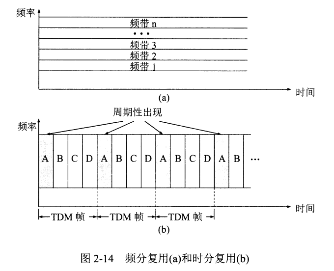
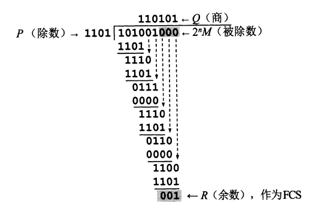
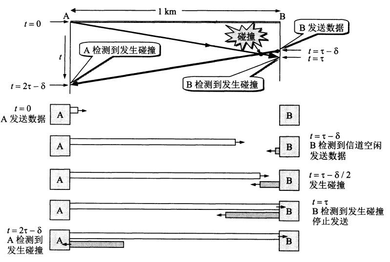
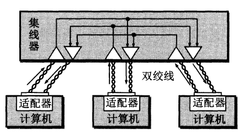
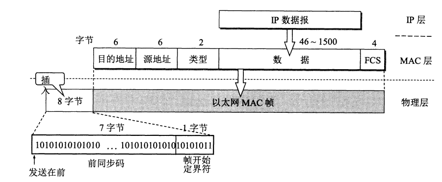

# 计算机网络

这是计算机网络的大纲（大概）

[TOC]

------

# 第一章：概述

本章重要的内容有：

- 互联网边缘部分和核心部分的作用；分组交换的概念。

- 网络性能的指标。

- 计算机网络分层次的体系结构；协议和服务的概念

  

## 1.1 计算机网络在信息时代中的作用

## 1.2 互联网概述

### 1.2.1 网络的网络

​	<u>计算机网络</u>由若干<u>节点</u>和连接这些节点的<u>链路</u>组成。

### 1.2.2 互联网基础结构发展的三个阶段

### 1.2.3 互联网的标准化工作

## 1.3 互联网的组成

### 1.3.1 互联网的边缘部分

 1. 客户-服务器方式

    客户是服务请求方，服务器是服务提供方。

 2. 对等连接方式

### 1.3.2 互联网的核心部分

 1. 电路交换的主要特点

    必须经过“<u>建立连接-通话-释放连接</u>”三个步骤的交换方式称为<u>电路交换</u>。

 2. 分组交换的主要特点

    分组交换采用<u>存储转发</u>技术。每一个分组在互联网中独立地选择传输路径，并被正确地交付到分组传输的终点。

    分组交换有<u>高效、灵活、迅速、可靠</u>的优点，但是在路由器存储转发的过程中需要排队，因此会造成一定的<u>时延</u>。

    若要传输大量的数据，且传送时间远大于连接建立时间，则适合使用电路交换；否则应当使用报文交换或者分组交换。

## 1.4 计算机网络在我国的发展

## 1.5 计算机网络的类别

### 1.5.1 计算机网络的定义

​	计算机网络主要是由一些通用的、可编程的硬件互连而成的，而这些硬件并非专门用来实现某一特定目的。这些可编程的硬件能够用来传送多种不同类型的数据，并能支持广泛的和日益增长的应用。（一定有CPU）

### 1.5.2 几种不同类别的计算机网络

 1. 按照网络的作用范围进行分类

    广域网WAN、城域网MAN、局域网LAN、个人局域网PAN

 2. 按照网络的使用者进行分类

    公用网、专用网

 3. 用来把用户接入互联网的网络

    接入网AN

## 1.6 计算机网络的性能

### 1.6.1 计算机网络的性能指标

 1. 速率（$10^x$表示)

    bit/kbit/Mbit/Gbit/Tbit/Pbit/Ebit/Zbit/Ybit

 2. 带宽

    在计算机网络中，网络带宽表示单位时间内某信道所能通过的<u>最高数据率</u>，单位是bit/s。

 3. 吞吐量

    吞吐量表示在单位时间内通过某个网络的<u>实际数据量</u>。

 4. 时延

    总时延的计算公式
    $$
    总时延 = 发送时延 + 传播时延 + 处理时延 + 排队时延
    $$
    发送时延的计算公式：
    $$
    发送时延 = \frac{数据帧长度(bit/s)}{发送速率(bit/s)}
    $$
    传播时延的计算公式：
    $$
    传播时延 = \frac{信道长度(m)}{电磁波在信道上的传输速率(m/s)}
    $$
    通常有铜线 = $2.3*10^5(km/s)$，光纤 = $2.0*10^5(km/s)$。

    在某些情况下，低速率、小时延的网络可能优于一个高速率、大时延的网络。

 5. 时延带宽积
    $$
    时延带宽积 = 传播时延 * 带宽
    $$

 6. 往返时间RTT

    在计算机网络中，<u>往返时间</u>也是一个重要的性能指标。

    这是因为在许多情况下，互联网上的信息不仅仅是单方面的，而是双向交互的。

 7. 利用率

    网络当前时延计算公式如下：
    $$
    网络当前时延 = \frac{网络空闲时的时延}{1-当前网络利用率}
    $$
    写作如下的公式：
    $$
    D = \frac{D_{0}}{1-U}
    $$

	可以看到，随着利用率的增大，时延急剧增大。

### 1.6.2 计算机网络的非性能特征

​	1. 费用

​	2. 质量

​	3. 标准化

​	4. 可靠性

​	5. 可扩展性和可升级性

​	6.易于管理和维护

## 1.7 计算机网络体系结构

在计算机网络的基本概念中，<u>分层次的体系结构</u>是最基本的。

### 1.7.1 计算机网络体系结构的形成

### 1.7.2 协议与划分层次

​	<u>为了进行网络中的数据交换而建立的规则、标准或者约定称为网络协议，简称为</u><u>协议</u>。

​	协议应当由以下三要素组成：<u>语法、语义与同步</u>。

### 1.7.3 具有五层协议的体系结构

​	应用层、运输层、网络层、数据链路层、物理层。

### 1.7.4 实体、协议、服务与服务访问点

​	实体：任何可能发送或接受信息的硬件或软件进程。

​	协议：控制两个或多个对等实体进行通信的规则的集合。

​	<u>在协议的控制下，两个对等实体间的通信使得本层能向上一层提供服务</u>。要实现本层协议，还需要使用下面一层所提供的<u>服务</u>。

​	协议的实现确保了能够向上一层提供服务，使用本层服务的实体只能看到服务而看不到下面的协议，也即下面的协议对上面的实体是透明的。

------

# 第二章：物理层

本章的重要内容：

- 物理层的任务。

- 几种常用的信道复用技术。

- 几种常用的宽带接入技术；FTTx。

  

## 2.1 物理层的基本概念

物理层考虑的是怎样才能在连接各种计算机的传输媒体上传输数据比特流，而不是具体的传输媒体。

## 2.2 数据通信的基础知识

### 2.2.1 数据通信系统的模型

​	一个数据通信系统可以分为三大部分：<u>源系统、传输系统、目的系统</u>。

​	源系统一般包含：<u>源点、发送器</u>；目的系统一般包含：<u>接收器、终点</u>。

​	<u>通信</u>的目的是传送消息；<u>数据</u>是运送消息的实体；<u>信号</u>是数据的电气/电磁表现，可以分为<u>数字信号</u>与<u>模拟信号</u>。

### 2.2.2 有关信道的几个基本概念

​	信道不等同于电路，信道一般用来表示向某一个方向传输信息的媒体。从通信的双方信息交互的方式来看，有三种方式：

 1. 单向通信

    又称为<u>单工通信</u>，比如无线电广播。

 2. 双向交替通信

    又称为<u>半双工通信</u>。一方发送另一方接受，一段时间后再反过来。

 3. 双向同时通信

    又称为<u>全双工通信</u>，双方可以同时发送和接收信息。

​	

​	来自信源的信号常称为<u>基带信号</u>，比如计算机输出的各种文字、图像的数据信号就是基带信号。它往往包含了较多的低频分量，甚至有直流分量。而许多信道不能传输这种低频分量或直流分量，因此需要<u>调制</u>。

​	调制可以分为两类：

- 基带调制（编码）

  仅仅对基带信号的波形进行变换，使它能够与信道特性相适应。变换后的信号仍然是基带信号。

  因为它只是把数字信号转换为另一种数字信号，因此也叫做编码。

- 带通调制

  利用<u>载波</u>进行调制，把基带信号的频率范围移动到更高的频段，并转换为模拟信号，便于在模拟信道中传输。

​	常用编码方式：不归零制、归零制、曼彻斯特编码、差分曼彻斯特编码。

​	曼彻斯特编码产生的信号频率比不归零制要高。

​	基本的带通调制方法：调幅、调频、调相。（模拟信号：$ Asin(ωt+φ)$）

​	采用<u>正交振幅调制QAM</u>可以达到更高的信息传输速率。

​	

### 2.2.3 信道的极限容量

​	从概念上讲，限制码元在信道上的传输速率的因素有：

1. 信道能够通过的频率范围

   <u>奈氏准则</u>：在<u>带宽为W（Hz）</u>的低通通道中，若不考虑噪声影响，则<u>码元传输的最高速率是2W（码元/s）</u>。传输速率超过此上限就会出现严重的码间串扰问题，使得接收端对于码元的判别变得不可能。

   奈氏准则告诉我们：可以提高码元携带的比特量。

2. 信噪比

   信噪比是信号的平均功率和噪声的平均功率之比，记为S/N。但是常用分贝（db）作为度量单位，即：
   $$
   信噪比(dB)=10log_{10}(\frac{S}{N})(dB)
   $$
   例如当S/N=10时，信噪比为10dB。

   

   <u>香农公式</u>：信道的极限信息传输速率：
   $$
   C=Wlog_{2}(1+\frac{S}{N})(bit/s)
   $$
   其中W为信道带宽(Hz)，S为信道内传信号的平均功率，N为信道内的高斯噪声功率。

   香农公式表明，<u>信噪比越大，信息的极限传输速率就越高</u>。也就是说，只要信息传输速率低于信道的极限信息传输速率，就有办法实现无差错的传输。

   香农公式告诉我们：无论采用什么编码都不能突破速率极限。

   

   而当带宽确定、信噪比无法提高的时候，就要使得<u>每一个码元携带更多比特的信息量</u>来提高信息传输速率。

   比如对于101001010，直接传送的码元信息量为1bit，但是将每3bit编组，并用利用调制，比如相位调制，则可以用三个相位来表示，则此时同样时间传输的信息量是原来的三倍。

## 2.3 物理层下面的传输媒体

传输媒体（传输介质、传输媒介）可以分为两类：导引型传输媒体、非导引型传输媒体。

### 2.3.1 导引型传输媒体

 1. 双绞线

    双绞线是最老的、最常用的传输媒体。

    无屏蔽双绞线 < 屏蔽双绞线

 2. 同轴电缆

 3. 光缆

    光纤通信是利用光导纤维传递光脉冲来通信的。光线在纤芯中传输的方式是不断地全反射。

### 2.3.2 非导引型传输媒体

​	无线电微波通信：沿直线传播。当基站发出的信号被阻挡，于是产生多条路径到达手机的时候，多条路径的信号叠加会差生较大的失真，称为<u>多径效应</u>，需要解决。

​	当利用无线信道传输数字信号的时候，需要使误码率不大于容许的范围。

- 对于给定的调制方式和数据率，信噪比越大，误码率越低。
- 对于同样的信噪比，具有更高数据率的调制技术的误码率也更高。
- 如果地理位置在不断改变，就会引起信噪比和误码率的改变。

​	卫星通信是一种利用人造同步卫星作为中继器的微波接力通信，最大的特点是通信距离远、通信费用和通信距离无关，但是也有较大的时延。

## 2.4 信道复用技术

复用是通信技术中的基本概念。

复用是利用复用器和分用器实现一个信道传输多路信号的操作。

### 2.4.1 频分复用、时分复用、统计时分复用

​	频分复用FDM：频分复用是利用调制的方法，将各路信号移动到合适的频率位置。各路信号在同样的时间占用不同的频率带宽资源。

​	时分复用TDM：将时间划分为一段段等长的时分复用帧，每个型号所占用的时隙周期性的出现。所有用户在不同时间占用同样的频段宽度。

​	让多个用户轮流使用N个频段称为频分多址接入FDMA；让多个用户轮流使用时隙称为时分多址接入TDMA。

​	统计时分复用STDM是一种改进的时分复用。统计时分复用使用STDM帧来传送数据，但是帧中的时隙数小于用户数，而当用户有了数据就发送到集中器的输入缓存中，然后集中器把缓存缓存中的数据输入到帧中，帧满了就发送。

### 2.4.2 波分复用

​	波分复用WDM，就是<u>光的频分复用</u>，使用一根光纤来传输多个频率接近的光载波信号。

### 2.4.3 码分复用

​	码分复用CDM是另一种共享信道的方法。当码分复用信道为多个不同地址的用户所共享的时候就称为码分多址CDMA。

​	码分复用的每一个人可以在同样的时间使用同样的频带进行通信，但由于码型不同，因此用户之间不会产生干扰。

​	在CDMA中，每一个比特时间再划分为m个短的间隔，称为<u>码片</u>，使用CDMA的每一个站都被指派唯一的 $m$ bit码片序列。对于发送，有以下规则：

- 如果要发送比特1，则发送 $m$ bit码片序列。
- 如果要发送比特0，则发送该码片序列的反码。

​	例如，指派给S站的8bit码片序列为00011011，则如果要发送比特1则发送序列00011011，而发送比特0时则发送11100100。为了方便，在这里我们将其中的0记为-1，1记为+1，也即S站的码片序列为（-1 -1 -1 +1 +1 -1 +1 +1）。

​	在这里可以看出，如果要发送的信息数据率为 $b$ bit/s, 而S站如果有 $m$ bit码元序列，则实际上发送的数据率要到 $mb$ bit/s。因此需要用到<u>扩频</u>技术。在这里使用的是<u>直接序列扩频DSSS</u>，还有一种方法是<u>调频扩频FHSS</u>。

​	

​	CDMA系统有一个重要特点：每个站的码片序列不仅必须各不相同，还必须<u>正交</u>。在这里假设两个站的码片序列为$\vec{S}$, $\vec{T}$，则应当有：
$$
\vec{\mathbf{S}} \cdot \vec{\mathbf{T}} =0
$$
​	不仅如此，我们还可以看出，任何一个码片序列向量和自己的规格化内积都是0：
$$
\mathbf{\vec{S}} \cdot \mathbf{\vec{S}} = 1
$$
​	同理，我们也可以得到如果一个码片向量和反码的向量的规格化内积为-1。	

​	那么现在，假设有一个X站要接收S站发送的信号，则X站必须知道S站的码片序列，然后利用X站得到的码片向量$\vec{S}$进行解码。假设还有一个T站也在发送序列$\vec{T_{x}}$，则根据叠加原理，可以这么计算：
$$
\begin{array}{l}  
接收到的信号 \\
= \vec{S} \cdot (\vec{S_{x}} + \vec{T_{x}}) \\
= \vec{S} \cdot \vec{S_{x}} + \vec{S} \cdot \vec{T_{x}} \\
= \vec{S} \cdot \vec{S_{x}} (发送的数据比特，因为运算的结果一定是+1/-1) + 0(一定为0，因为正交) \\
= 发送的数据
\end{array}
$$

## 2.5 数字传输系统

早期的数字传输系统速率标准不统一、也不是同步传输。

## 2.6 宽带接入技术

从宽带的接入媒体来看，可以划分为两大类：有线宽带接入、无线宽带接入。

### 2.6.1 ADSL技术

​	非对称用户数字线ADSL技术是<u>用数字技术对现有模拟电话的用户线进行改造</u>。它把0~4KHz低端频谱留给传统电话使用，而把较高频谱给用户上网使用。因为下行带宽远大于上行带宽，因此是“非对称”。

​	ADSL两端都需要安装ADSL调制解调器。我国采用的是离散多音调DMT调制技术。这种做法相当于在一对用户线上使用许多小的调制解调器并行的传输数据。

​	基于ADSL的接入网由<u>数字用户线接入复用器DSLAM、用户线、用户家中设施</u>三部分组成。ADSL可以利用现有的电话网中的用户线，而不需要重新布线。

### 2.6.2 光纤同轴混合网（HFC网）

​	光纤同轴混合网是在目前覆盖面很广的有线电视网的基础上开发的一种居民宽带接入网。目前的HFC网具有双向传输功能，而且扩展了传输频带。

​	要使现有的模拟电视能接收数字信号，需要把<u>机顶盒</u>连接在同轴电缆和电视机之间。为了使用户能够接入互联网，还需要增加<u>电缆调制解调器</u>。

### 2.6.3 FTTx技术

​	光纤到户FTTH是最好的选择，这可以使用户获得最高的上网速率。FTTx中的x表示不同的光纤接入地点。

​	为了有效地利用光纤资源，在光纤干线和广大用户之间，还要铺设一段中间的转换装置<u>光配线网</u>，使得数十个家庭用户能共享一个光纤干线。光配线网使用波分复用，上行和下行使用不同的带宽。

------

# 第三章：数据链路层

数据链路层使用的信道主要分为：点对点通信、广播信道。

本章的重要内容有：

- 数据链路层的点对点信道和广播信道的特点，以及PPP协议、CSMA/CD协议的特点。
- 数据链路层的三个问题：封装成帧、透明传输以及差错检测。
- 以太网MAC层的硬件地址。
- 适配器、转发器、集线器、网桥、以太网交换机的作用以及使用场合。

## 3.1 数据链路层的几个问题

### 3.1.1 数据链路和帧

​	数据链路指的是传输数据的线路、协议、实现协议的硬件、软件等的集合体。现在最常用的方法就是网络适配器来实现这些协议，一般的网络适配器都会包括数据链路层和物理层两层的功能。

​	帧是点对点通信的数据链路层的协议数据单元。数据链路层把网络层放下来的数据封装成帧，并把接受大的帧中的数据取出交给网络层。

### 3.1.2 三个基本问题

​	数据链路层的协议有很多，但是三个基本问题是共同的：封装成帧，透明传输和差错检测。

1. 封装成帧

   ​	封装成帧是指在一段数据的前后分别添加首部和尾部，这样就构成了一个帧。首部和尾部的一个重要作用是帧定界，除此之外也包含了必要的控制信息。

   ​	每一种链路层协议都规定了能传送帧的数据部分长度上限，也即最大传送单元 MTU 。

   

   ​	对于一个帧来说，用 SOH 标识头部、EOT 标识尾部，其对应的ASCII码为01、04。

   

2. 透明传输

   ​	透明是指，某一个实际存在的事物看起来却好像不存在一样。

   ​	在传输中，如果出现了某一个字节正好与 SOH 或者 EOT 对应的二进制代码一样的情况，那么数据链路层就会错误的找到帧的边界。为了解决这个问题，就必须使得数据中可能出现的 SOH 或者 EOT 不被解释为控制字符。

   ​	一般的方法是，在数据中的 SOH 或者 EOT 前面插入一个转义字符  ESC （1B），而接收时则会删除这个转义字符。这种方法也被称为**字节填充**或是**字符填充**。

   ​	如果转义字符也出现在数据中，那么就应当在转义字符前也添加一个转义字符。

   

   

3. 差错检测（重要）

   ​	在传输过程中，比特可能会产生差错：1变0，0变1都是有可能的。这种差错叫做**比特差错**。为了解决 差错问题，目前在数据链路层最广泛使用的检错技术叫做：<u>循环冗余检验 CRC</u>。

   ​	CRC 在发送端把数据划分成组，假设划分完成之后的数据 M 有 k 位，则在 M 后面添加 n 位**冗余码**，然后构成一个 k+n 位的帧发送出去，以此完成差错检验。

   ​	这 n 位冗余码可以这样得出：在 M 后面添加 n 个0，然后用得到的 k+n 位数除以事先规定好的 n+1 位除数 P，得到商 Q 和 余数 R（n 位，比 P 少一位）。这个余数 R 就是冗余码，我们称它为<u>帧检验序列FCS</u>。

   ​	而在接收端，把接收到的每一个帧都除以相同的除数 P ，然后检查得到的余数 R ，如果传输无差错，那么 R 肯定为 0。

   

   ​	在这里需要注意的是，CRC 和 FCS 并无关系。CRC 是一种检错方法，而 FCS 是冗余码。在检错方法中，可以使用 CRC，也可以不使用。

   

   ​	但是利用 CRC 的话，也只能做到检测比特差错，对于传输差错则并不能检验，因此这还不是可靠传输。在过去认为，必须让数据链路层向上提供可靠传输，也即在 CRC 的基础上增加帧编号、确认和重传机制，但是现在采用了其他的方法：

   ​	1、对于通信质量良好的链路，不要求数据链路层向上提供可靠传输的服务。如果出现了差错，则由上层协议改正差错。

   ​	2、对于通信质量不好的线路，数据链路层协议使用确认和重传机制，由数据链路层向上提供可靠传输的服务。

## 3.2 点对点协议 PPP

对于点对点的链路，PPP 是目前使用的最广泛的数据链路层协议。

### 3.2.1 PPP 协议的特点

1. PPP 协议应满足的要求

   1、简单

   2、封装成帧

   3、透明性

   4、多种网络层协议

   5、多种类型链路

   6、差错检测

   7、检测连接状态

   8、最大传送单元

   9、网络层地址协商

   10、数据压缩协商

   

2. PPP协议的组成

   1、一个将IP地址封装到串行链路的方法。

   2、一个用来建立、配置和测试数据链路连接的链路控制协议。

   3、一套网络控制协议。

### 3.2.2 PPP 协议的帧格式

​	首部有四个字段，尾部有两个字段。首部第一个字段和尾部第二个字段都是标志字符 F（7E)，而首部中的地址字段规定为 A ，控制字段规定为 C 。

​	首部的第四个字段是 2 字节的协议字段，若为 0x0021 时，PPP 帧信息字段为 IP 数据报；为 0xC021 时，为 PPP 链路控制协议 LCP 的数据；为 0x8021时，标识这是网络层的控制数据。

​	尾部第一个字段是使用 CRC 的帧检验序列 FCS。

​	

​	当 PPP 使用异步传输（逐个字符的传输）的时候，他把转义符定义为 0x7D，并使用字节填充。而当他在同步传输（一连串比特连续发送）的时候，使用零比特填充的方法实现透明传输：每当发现出现5个连续的1时，就填入一个1，防止出现6个1。

### 3.2.3 PPP 协议的工作状态

​	PPP 链路的起始和终止状态永远是链路静止状态，这时在用户个人电脑和 ISP 的路由器之间并不存在物理层的连接。

## 3.3 使用广播信道的数据链路层

广播信道可以进行一对多的通信，局域网使用的就是广播信道。

### 3.3.1 局域网的数据链路层

​	局域网的最主要的特点是：网络为一个单位所拥有，且地理范围和站点数目均有限。

​	局域网可以按照网络拓扑进行分类：

​	共享信道要着重考虑的一个问题是，如何使众多用户能海购合理方便地享受通信媒体资源，这在技术上有两种方法：

- 静态划分信道，如频分复用、时分复用、波分复用、码分复用等。用户只要分配到了信道就不会发生冲突，但是代价较高。
- 动态媒体接入控制，又称多点接入，可以分为随机接入和受控接入。随机接入地特点是用户可以随机的发送信息，但是必须要有解决碰撞的协议。

​	在这里，我们着重讨论属于随机接入的以太网。

1、以太网的两个标准

​	目前使用最多的局域网是 DIX Ethernet V2 ，简称以太网，而不是IEEE 802委员会制定的局域网。

2、适配器的作用

​	计算机和外界局域网是通过**适配器**。

- 适配器和局域网之间的通信是通过电缆以串行方式进行的，而适配器和计算机之间的通信是通过总线以并行方式进行的，因此适配器需要能串行并行转换。
- 因为网络上的数据率和计算机总线的并不相同，因此要有缓存芯片。
- 还要能把管理适配器的驱动程序安装在计算机的操作系统中。
- 还要能够实现以太网协议。

​	

​	适配器在接收和发送数据的时候，不适用计算机的CPU。

### 3.3.2 CSMA/CD 协议

​	最早的以太网是将许多计算机连接在一根总线上。当一台计算机发送数据时，总线上的所有计算机都能检测到这个数据，这种就是广播通信。

​	为了简便的通信，以太网采取了两种措施：

1. 采用**无连接**的工作方式，不必先建立连接就可以直接发送数据。因此，以太网提供的是**不可靠的交付**。

   我们知道，总线上在同一时间只能允许一台计算机发送数据，否则就会产生干扰。因此以太网使用 **CSMA/CD（载波监听多点接入/碰撞检测）协议**来减少冲突。

2. 以太网发送的数据都使用**曼彻斯特编码**的信号。

​	下面介绍 CSMA/CD 协议的要点：

​	“多点接入”就是说明这是总线型网络，协议的实质是“载波监听”和“碰撞检测”。

​	“载波监听”是指检测总线上是否有其他计算机在发送。不管是在发送前，还是发送中，每个站都必须不停的检测信道。如果检测到已经有其他站在发送，则自己暂时不发送。

​	“碰撞检测”也就是“边发送边监听”，即适配器边发送数据边检测信道上的信号电压，当电压超过一定的阈值时，就认为有至少两个站在发送数据，表明产生碰撞。一旦发现总线出现碰撞，就要立即停止发送。

​	但是为什么在发送前监听到信道已经“空闲”，还是可能会出现碰撞？这是因为电磁波的传输速率是有限的，比如在 1km 的电缆中传播时延约为 5μs 。因此，还是有可能产生碰撞的。

​	在局域网的分析中，把单程的端到端传输时延记为 t ，则最迟需要 2t 的时间才能知道有无发生碰撞。

​	显然，在使用 CSMA/CD 协议的时候，一个站不可能同时进行发送和接收，因此使用 CSMA/CD 的以太网只能进行**半双工通信（双向交替通信）**。由此可见，每一个站在在自己发送数据之后的一小段时间内，存在着遭遇碰撞的可能性，而这一小段时间是不确定的。

​	在以太网中，我们称 **2t** 为**争用期**。这是一个重要的参数，又称为**碰撞窗口**。具体来说，争用期是 **51.2μs** 。对于一个 10 Mbits/s 的网络来说，争用期可以发送 512 bit，或者说是 64 字节，因此称其争用期为 512bit。

​	除此之外，以太网还规定帧的最小长度是 64 字节，**小于 64 字节的帧都是由于冲突而异常终止的无效帧**。

​	当发送数据的站一旦发现产生碰撞的时候，要继续发送一个 32 比特或者 48  比特的**人为干扰信号**，让所有用户知道发生了碰撞。这被称为**强化碰撞**。

​	以太网还规定帧间最小间隔为 9.6μs 相当于 96 比特时间。这样是为了让站做好接收下一帧的准备。

​	根据以上所讨论的，可以把 CSMA/CD 协议的要点归纳如下:

​	(1)准备发送:适配器从网络层获得一个分组，加上以太网的首部和尾部(见后面的3.4.3 节)，组成以太网，放入适配器的缓存中。但在发送之前，必须先检测信道。

​	(2)检测信道:若检测到信道忙，则应不停地检测，一直等待信道转为空闲。若检测到信道空闲，并在 96 比特时间内信道保持空闲(保证了间最小间隔)，就发送这个帧。

​	(3)在发送过程中仍不停地检测信道，即网络适配器要边发送边监听。这里只有两种可能性:

​		1、发送成功:在争用期内一直未检测到碰撞。这个帧肯定能够发送成功。发送完毕后，其他什么也不做。然后回到(1)。

​		2、发送失败:在争用期内检测到碰撞。这时立即停止发送数据，并按规定发送人为干扰信号。适配器接着就执行指数退避算法，等待广倍 512 比特时间后，返回到步(2)，继续检测信道。但若重传达 16 次仍不能成功，则停止重传而向上报错。

​	以太网每发送完一帧，一定要把已发送的帧暂时保留一下。如果在争用期内检测出发生了碰撞，那么还要在推迟一段时间后再把这个暂时保留的帧重传一次。

### 3.3.3 使用集线器的星型拓扑

​	以太网发展到后来采用来星型拓扑的结构，在星形的中心增加了集线器。

​	集线器的特点有：

1. 从表面上看是星形网，但是实际上整个系统在逻辑上还是总线网，使用的还是 CSMA/CD 协议。在同一时刻至多允许一个站发送数据。

2. 一个集线器有多个端口，像是一个多端口的转发器。

3. **集线器工作在物理层**，每个接口也只是简单的转发比特，**不进行碰撞检测**。

   

### 3.3.4 以太网的信道利用率

​	因为碰撞的存在，以太网的信道利用率实际上无法达到100%。

​	从图中可以看出，发送一个帧需要占用信道的时间是 $T_0 + \tau $，比发送这个帧的时间要多一个单程端到端时延。从图中可以看出，如果要提高信道利用率，就必须降低 $\alpha = \frac{\tau}{T_0}$ 的值。也就是说，$\tau$ 的值药效，而 $T_0$ 的值要大，也就是说数据率一定时，以太网的连线受到长度限制，否则 $\tau$ 的数值会太大；同时以太网的帧长不能太短，否则 $T_0$ 会小。

### 3.3.5 以太网的 MAC 层

- MAC层的硬件地址

  ​	在局域网中，**硬件地址**又称为**物理地址**或者 **MAC地址** 。为了让名字与系统的所在地无关，IEEE 802制定了一种 48 位的全球地址，这就是固化在适配器 ROM 中的地址。IEEE 的注册管理机构 RA 负责分配地址字段的六个字节中的前三个字节。凡事要生产局域网适配器的厂家都必须向 IEEE 购买这三个字节组成的号。

  ​	当路由器通过适配器连接到局域网的时候，适配器的硬件地址就用来标志路由器的某个接口。我们知道适配器有**过滤功能**：如果是接收到发往本站的帧就留下，否则丢弃。在这里，发往本站的帧包括三种：单播帧、广播帧、多播帧。

  ​	除此之外，以太网适配器还可以设置成一种特殊的模式：**混杂方式**。这种方式会把以太网上的帧都记录下来。

  ​	

- MAC帧的格式

  ​	这里介绍的是使用最多的以太网 V2 的 MAC 帧格式。

  

  ​	以太网 V2 的 MAC 较为简单，由五个字段组成：

  ​	前两个字段分别为 6 字节长的目的地址和源地址字段。

  ​	第三个字段是 2 字节的类型字段，用来标志上一层使用的是什么协议，以便把收到的 MAC 的数据上交给上一层的这个协议。例如，当类型字段的值是 0x0800时，就表示上层使用的是 IP 数据报。
  ​	第四个字段是数据字段，其长度在 46 到 1500 字节之间 （46 字节是这样得出的：最小长度 64 字节，减去 18 字节的首部和尾部就得出数据字段的最小长度）。

  ​	最后一个字段是 4 字节的帧检验序列 FCS（使用 CRC 检验）。FCS 的检验范围是整个 MAC 帧，从目的地址到 FCS 的五个字段，但不包括物理层插入的。

  

  ​	从图中也能看出，在传输媒体上实际传输的要比 MAC 帧还多 8 个字节，这是因为一个站在刚开始接收的时候，尚未达成同步，会导致整个 MAC 帧无效。

  ​	IEEE 802.3标准规定凡出现下列情况之一的即为无效的MAC :
  ​	(1)的不是整数个字节;
  ​	(2)用收到的检验序列FCS查出有差错
  ​	(3)收到的的MAC客户数据字段的长度不在46 ~ 1500 字节之间。考虑到MAC 首部和尾部的长度共有 18 字节，可以得出有效的MAC 长度为 64~1518 字节之间。
  ​	

  ​	对于检查出的无效 MAC 就简单地丢弃。以太网不负责重传丢弃的帧。重传由更高层完成。

## 3.4 扩展的以太网

在许多情况下，我们希望把以太网的覆盖范围扩展。先讨论在物理层扩展以太网，然后讨论在数据链路层扩展。这种扩展的以太网仍然是一个网络。

### 3.4.1 在物理层扩展以太网

​	现在扩展主机和集线器之间的距离的一种简单方式就是使用光纤，以及一对光纤调制解调器。

​	如果使用多个集线器，就可以构成更大的以太网。

​	这样做，可以使不同以太网上的计算机能够进行交流，也扩大了以太网的覆盖范围。

### 3.4.2 在数据链路层扩展以太网

​	最初人们使用的是网桥。后面替换成使用交换式集线器（也被称为以太网交换机）。

1. 以太网交换机的特点

   ​	以太网交换机本质上是一个多端口的网桥，每个端口都直接与一个单台主机或者另一个以太网交换机相连，并且一般工作在全双工模式。相互通信的主机都**独占传输媒体，无碰撞的传输数据**。比如对于一个 10Mbit/s 的以太网，一个10个端口的交换机的总容量就为 100Mbit/s 。

   ​	交换机内部的帧交换表是通过自学习算法建立起来的。这也是交换机的最大优点。

   

2. 以太网交换机的自学习功能

   ​	对于一个交换机，交换机需要记录的信息是**源地址**和端口。

   

   ​	此外，考虑到交换机的端口的主机可能变换，因此在交换表中写入之后会记录时间。超过一定时间之后就会被删除。

   

   ​	有时，为了增加网络的可靠性，会增加一些冗余的链路。这种情况下，可能会产生无限的循环。

   

   ​	因此，IEEE 802.1D 标准制定了**生成树协议 STP**，在不改变网络拓扑结构的前提下，在逻辑上切断某些链路，使得一台主机到所有其他主机的路径是**无环路的树状结构**。

   

3. 从总线以太网到星形以太网

   

### 3.4.3 虚拟局域网

​	在以太网交换机出现后，我们可以灵活的建立虚拟局域网。这样就能把较大的局域网，分割成一些较小的局域网。

​	虚拟局域网只是局域网给用户提供的一种服务，并不是一种新型局域网。在虚拟局域网中，每台计算机都是通过**接入链路**连接到以太网交换机中的，而连接交换机端口之间的链路称为**汇聚链路**。

## 3.5 高速以太网

随着电子技术的发展，以太网的速率也不断提升。

### 3.5.1 100BASE-T 以太网

### 3.5.2 吉比特以太网

​	吉比特以太网的物理层使用两种技术：一种来自现有的以太网；另一种是 ANSI 制定的光纤通道 FC 。吉比特以太网工作在半双工模式的时候，必须进行碰撞检测。吉比特以太网保持一个网段的最大长度为 100 m，但采用**“载波延伸”**的方法，使最短帧长为 64 字节，同时将争用期增加值 512 字节。

​	吉比特还增加了**分组突发**的功能。当第一个短帧发送完之后，随后的一些短帧可以一个接一个的发送，只需要保留必要的帧最小间隔即可。

​	当吉比特以太网工作在全双工模式的时候，不适用载波延伸和分组突发。

### 3.5.3 10Gbe 以太网和更快的以太网

​	10Gbe 的帧格式与 10 Mbit/s、100 Mbit/s 和 1 Gbit/s 的帧根式完全相同，并保留了 802.3 标准规定的最小帧长和最大帧长。**10Gbe 只工作在全双工模式，因此不存在争用问题，也不使用 CSMA/CD 协议。**

# 第四章：网络层

# 第五章：运输层

# 第六章：应用层

# 第七章：网络安全

# 第八章：互联网上的音视频服务

# 第九章：无线网络和移动网络

